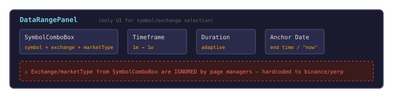
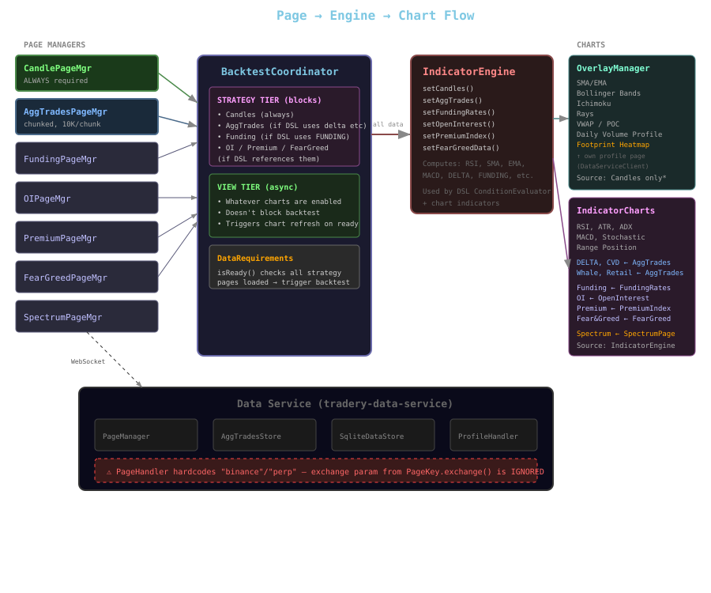
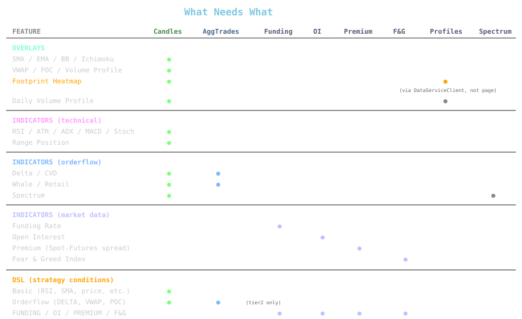
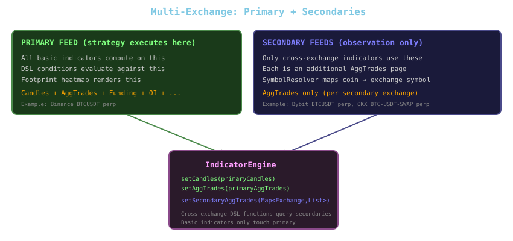

# Data Flow Architecture — Pages, Indicators & Exchange Selection

## Current State Overview

The system has a clean two-tier data loading model (STRATEGY vs VIEW), but **exchange and market type are hardcoded to `binance`/`perp`** at every layer.

---

## 1. Exchange/Pair Selection — Current Controls



**What happens today:**
- `DataRangePanel` exposes `getSymbol()`, `getTimeframe()`, `getMarketType()`
- `SymbolComboBox` lets user pick exchange + market type
- But `DataPageManager.makePageKey()` ignores those and hardcodes `"binance"` + `"perp"`
- Same hardcoding in `DataServiceClient.makePageKey()` and `PageHandler.requestPage()`

---

## 2. Page Types and Data Flow



---

## 3. Hardcoding Points — Where `binance/perp` is Baked In

| Layer | File | Line | What's Hardcoded |
|-------|------|------|-----------------|
| **Forge PageMgr** | `DataPageManager.makePageKey()` | 289 | `"binance"`, `"perp"` |
| **Forge Client** | `DataServiceClient.makePageKey()` | 187 | `"binance"`, `"perp"` |
| **Data Service API** | `PageHandler.requestPage()` | 36,39 | `"binance"`, `"perp"` |
| **Data Service PageMgr** | `PageManager.loadAggTrades()` | 616 | ignores `key.exchange()` |
| **Data Service Fetch** | `AggTradesStore` | throughout | only `BinanceVisionClient` |

**What already supports exchange:**
- `PageKey` record has `exchange` field
- `SqliteDataStore` routes to per-(exchange, marketType) SQLite files
- `AggTradesDao` scoped by (exchange, marketType) in constructor
- `ExchangeConfig` + `SymbolResolver` handle symbol mapping
- `AggTrade` record carries `exchange`, `marketType`, `normalizedPrice`
- `PriceNormalizer` has 4 normalization modes

---

## 4. Data Dependencies by Feature



---

## 5. What Multi-Exchange Would Change



### Key Design Decisions Needed

1. **Page keying** — `DataPageManager.makePageKey()` must accept exchange + marketType params instead of hardcoding
2. **BacktestCoordinator** — needs to request N additional AggTrades pages for secondaries
3. **IndicatorEngine** — needs a `Map<Exchange, List<AggTrade>>` for secondary feeds
4. **Data Service** — `PageHandler` must pass exchange from request to `PageKey`; `AggTradesStore` needs exchange client abstraction (Bybit/OKX clients already exist in forge)
5. **Strategy config** — needs a `secondaryFeeds` section listing additional exchange/pair combos
6. **UI** — coin picker → exchange/quote/market matrix for selecting secondaries

---

## 6. Current Indicator → Data Source Mapping

| Indicator / Overlay | Data Source | Page Type | Exchange Scope |
|---------------------|-----------|-----------|---------------|
| SMA, EMA, BB, Ichimoku | Candles | CandlePage | Primary only |
| RSI, ATR, ADX, MACD, Stoch | Candles | CandlePage | Primary only |
| VWAP, POC, VAH, VAL | Candles (tier1) or AggTrades (tier2) | Candle/AggTrades | Primary only |
| Delta, CVD | AggTrades | AggTradesPage | Primary only |
| Whale, Retail | AggTrades | AggTradesPage | Primary only |
| Footprint Heatmap | Volume Profiles | Direct HTTP (DataServiceClient) | Primary only |
| Daily Volume Profile | Volume Profiles | Direct HTTP | Primary only |
| Funding Rate | FundingRates | FundingPage | Primary only |
| Open Interest | OpenInterest | OIPage | Primary only |
| Premium | PremiumIndex | PremiumPage | Primary only |
| Fear & Greed | FearGreedIndex | FearGreedPage | N/A (market-wide) |
| Spectrum | SpectrumWindow | SpectrumPage | Primary only |
| **BINANCE_DELTA** (removed) | AggTrades filtered by exchange | AggTradesPage | **Multi-exchange** |
| **EXCHANGE_DIVERGENCE** (removed) | AggTrades from multiple exchanges | Multiple AggTradesPages | **Multi-exchange** |

---

## 7. Summary: Layers to Unblock Multi-Exchange

```
Layer 1: Data Service — accept exchange param in API, add Bybit/OKX fetch
Layer 2: Page System — pass exchange through makePageKey, support N aggTrades pages
Layer 3: Coordinator — request secondary pages, merge into engine
Layer 4: Engine — setSecondaryAggTrades(), re-add cross-exchange DSL functions
Layer 5: Strategy Config — secondaryFeeds: [{exchange, symbol, marketType}]
Layer 6: UI — coin-centric exchange/pair selector matrix
```
