## Volume & Orderflow

Volume and orderflow are where you move from "what happened" (price) to "why it happened" (who is buying and selling). This is where scalpers and institutional traders spend most of their time.

### Volume Basics

Volume confirms price moves. A breakout on high volume is more likely to sustain than one on low volume. Think of volume as conviction — if price moves up on massive volume, a lot of traders believe in the move.

- **Rising price + rising volume** = strong uptrend. Buyers are committed.
- **Rising price + falling volume** = weakening uptrend (divergence). Price is drifting up, but fewer people are participating. Smart money may already be selling.
- **Spike in volume** = significant event, often at reversals or breakouts. Someone big just entered or exited.

### Volume Profile

Volume profile shows how much volume traded at each price level, revealing where the market spent the most time — and therefore where the "fair value" is.

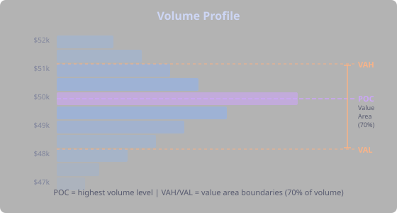

- **POC (Point of Control)** — the price level with the highest traded volume. Acts as a magnet — price tends to return to it. Think of POC as the price where the market was most comfortable.
- **VAH (Value Area High)** — upper boundary of the value area (typically 70% of volume)
- **VAL (Value Area Low)** — lower boundary of the value area

**How different traders use volume profile:**
- **Day traders** use the previous day's POC, VAH, and VAL as key levels. `close crosses_above PREV_DAY_POC` is a classic day-trading entry — it means the market just reclaimed yesterday's fair value.
- **Swing traders** use the volume profile to identify high-volume nodes (strong support) and low-volume nodes (where price moves fast because there's no "agreement" at those levels).
- **Mean reversion traders** use POC as their target — if price deviates far from POC, it's likely to return.

### Delta and Orderflow

**Delta** is the difference between aggressive buying volume and aggressive selling volume at each price level. This is the raw signal of who is in control right now.

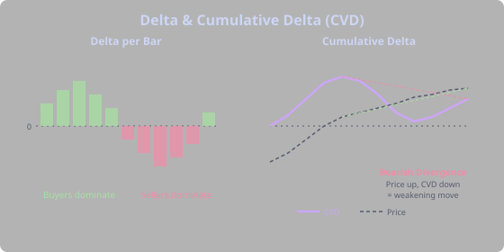

- **Positive delta** — more aggressive buyers (hitting the ask). Buyers are willing to pay the higher price to get filled immediately.
- **Negative delta** — more aggressive sellers (hitting the bid). Sellers are dumping.
- **Cumulative delta (CVD)** — running total of delta over time. Rising CVD with rising price = strong conviction; divergence (CVD falling, price rising) = weakening momentum.

Delta divergences are powerful signals and a favorite of experienced traders: if price is making new highs but cumulative delta is making lower highs, the move is being driven by short covering or passive buying, not aggressive buying. It often reverses.

### Footprint Charts

Footprint charts show the buy/sell breakdown at each price level within a candle. They're the highest-resolution view of market activity, and they're what separates retail chart-reading from professional orderflow analysis.

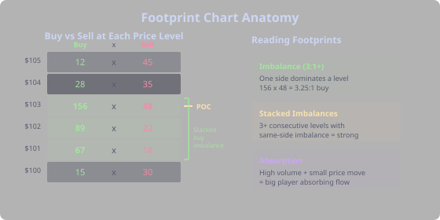

- **Imbalances** — where one side overwhelmingly dominates (e.g., 3:1 buy:sell ratio at a price level). Stacked imbalances (several levels in a row) show strong directional conviction.
- **Absorption** — high volume with minimal price movement. This means a large player is absorbing the opposing flow — taking the other side of a massive amount of orders without letting price move. It's often a sign that a big player is accumulating or distributing.
- **Stacked imbalances** — multiple consecutive price levels all showing the same imbalance direction. This is one of the strongest orderflow signals — it means aggressive buying or selling is happening across multiple price levels simultaneously.


## Market Regimes

### Trending vs Ranging

Markets alternate between two states, and the best strategy depends on which state is active. Using a trend-following strategy in a ranging market is like bringing a surfboard to a swimming pool — wrong tool for the conditions.

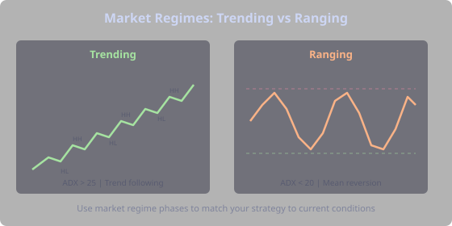

**Trending market:**
- ADX > 25
- Price respects moving averages (bouncing off them during pullbacks)
- Higher highs and higher lows (uptrend) or lower highs and lower lows (downtrend)
- Best strategies: trend following, breakout, momentum

**Ranging market:**
- ADX < 20
- Price oscillates between support and resistance
- Moving averages are flat and intertwined
- Best strategies: mean reversion, range trading

> **Tip:** Most markets spend 60-70% of their time ranging and only 30-40% trending. This is why pure trend-following systems have lower win rates — they generate false signals during all that range time. Using phases in Strategy Forge to filter by market regime is one of the highest-impact optimizations you can make.

### Trading Sessions

Crypto trades 24/7, but volume and volatility cluster around traditional market hours. Different sessions have different personalities:

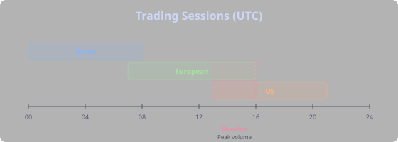

- **Asian session** (00:00-08:00 UTC) — the quiet hours. Lowest volatility, range-bound. Mean reversion strategies tend to work well here. Many breakouts during Asia reverse when Europe opens.
- **European session** (07:00-16:00 UTC) — moderate volatility. Often sets the direction for the day. London traders are influential in forex markets and increasingly in crypto.
- **US session** (13:00-21:00 UTC) — the main event. Highest volatility, most volume. This is where the big moves happen, driven by US institutional money. If a breakout happens during the US session on high volume, it's far more likely to sustain than one during Asia.
- **Session overlap** (13:00-16:00 UTC) — European + US overlap, peak liquidity. The most action-packed 3 hours of the day.

> **Tip:** Many successful day traders only trade during specific sessions. If your backtest shows dramatically better performance during `us-market-hours`, require that phase and skip the rest. No point leaving a strategy on during low-probability hours.

### Multi-Timeframe Analysis

The most reliable setups align across multiple timeframes. This is how professionals think about markets:

1. **Higher timeframe** (daily/4h) — determine the trend direction. "Am I bullish or bearish overall?"
2. **Trading timeframe** (1h/15m) — find entry signals. "Is there a setup right now?"
3. **Lower timeframe** (5m/1m) — fine-tune entries. "Can I get a better entry?"

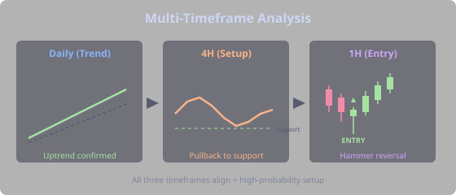

A setup that lines up on all three is much higher probability than one that only shows up on a single timeframe. If the daily shows an uptrend, the 4-hour shows a pullback to support, and the 1-hour shows a hammer — that's a confluence of signals across timeframes.

In Strategy Forge, use **phases** for multi-timeframe filtering. A phase on the daily timeframe (e.g., `uptrend` with `timeframe: 1d`) can filter entries on an hourly strategy. This is one of the most powerful features — your entry condition fires on the 1h chart, but it only triggers when the daily is also in an uptrend.


## The Phase System

Phases are multi-dimensional filters that control *when* your strategy is allowed to trade. They're separate from your entry condition — the entry condition defines *what* setup you're looking for, while phases define the *environment* in which that setup is valid.

Think of it this way: a hammer candle at support is your entry signal. But that same hammer means very different things depending on whether the daily trend is up, whether it's during US market hours, and whether there's an FOMC meeting in an hour. Phases let you encode all of that context.

### How Phases Work

Each phase has its own DSL condition and its own timeframe. The phase is "active" whenever its condition evaluates to true on its timeframe. Your strategy checks phase status at each bar:

- **Required phases** — ALL must be active for the strategy to take entries. If you require `[uptrend, us-market-hours]`, both must be true simultaneously.
- **Excluded phases** — NONE must be active. If you exclude `[fomc-meeting-day]`, the strategy sits out during FOMC days entirely.

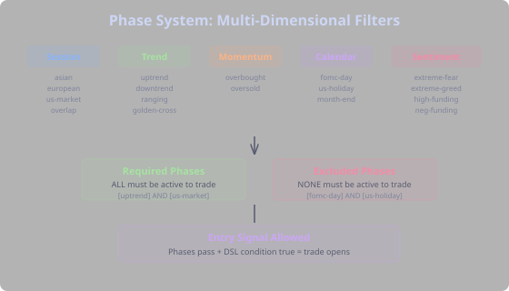

This separation is powerful because the phase timeframe can differ from your strategy timeframe. A phase on the daily chart (`uptrend` with `timeframe: 1d`) filters entries on an hourly strategy — giving you multi-timeframe analysis without writing complex conditions.

### Phase Categories

Strategy Forge includes 44+ built-in phases across several categories:

**Session phases** control which hours of the day you trade. Markets behave differently during Asian hours versus the US session overlap. Use `asian-session`, `european-session`, `us-market-hours`, or `session-overlap` to target the hours that suit your strategy.

**Trend phases** filter by the current market regime. `uptrend` (ADX > 25, +DI > -DI on the daily), `downtrend`, and `ranging` let you activate trend-following strategies only when there's actually a trend, and mean-reversion strategies only when the market is ranging.

**Momentum phases** like `overbought` and `oversold` use RSI on higher timeframes. Require `oversold` for a contrarian buy strategy, or exclude `overbought` to avoid entering longs at extremes.

**Calendar phases** are unique to Strategy Forge. `fomc-meeting-day` goes active on Federal Reserve meeting days — events that routinely cause 3-5% swings in crypto. `us-bank-holiday` catches low-liquidity days where strategies often underperform. `month-end` and `quarter-end` capture rebalancing periods. For deeper context on how Fed policy, inflation data, and geopolitical events drive crypto markets, see the [Macro](tab:Macro#why-macro-matters) tab.

**Sentiment phases** use the Fear & Greed Index: `extreme-fear` (index below 25), `fear`, `greed`, `extreme-greed`. Combine with technical conditions for powerful contrarian setups.

**Funding phases** track perpetual futures leverage: `high-funding` (overleveraged longs), `negative-funding` (overleveraged shorts), `extreme-funding` (either extreme). These precede squeezes and are some of the most predictive phase filters in crypto.

### Building a Filtered Strategy

The typical workflow:

1. **Start with a base condition.** Write your entry DSL: `RSI(14) < 30 AND close > SMA(200)`.
2. **Run a backtest** with no phases. Check the baseline metrics.
3. **Analyze phase performance.** Use the phase analysis tool to see how each phase correlates with your trade outcomes. It shows win rate when active vs. inactive.
4. **Add required phases** where you see a clear edge. If trades during `uptrend` win at 72% versus 45% overall, require it.
5. **Exclude harmful phases.** If `fomc-meeting-day` trades lose consistently, exclude it.
6. **Re-run and compare.** Your trade count drops, but win rate and profit factor should improve. Fewer trades, better trades.

> **Tip:** Don't over-filter. Each required phase reduces your trade count. If you require 5 phases simultaneously, you might get zero trades. Start with 1-2 high-impact phases and add more only if the data supports it.

### Custom Phases

Built-in phases cover the most common scenarios, but you can create custom phases for specific market conditions:

```yaml
id: my-volatility-filter
condition: ATR(14) > ATR(14)[1] * 1.2
timeframe: 4h
```

This custom phase is active when 4-hour ATR is expanding (current ATR is 20%+ above the previous bar's ATR). You might require this for breakout strategies that need volatility to work, or exclude it for mean-reversion strategies that need calm conditions.

Custom phases use the same DSL as entry conditions — any valid DSL expression works. Combine indicators, price levels, time functions, and even orderflow metrics. See the [Entry Strategies](tab:Strategy#entry-strategies) section for condition examples.


## Chart Patterns with Hoops

### What Hoops Solve

Many chart patterns — double bottoms, head and shoulders, bull flags, cup and handle — are sequences of price movements that unfold over time. Unlike single-bar [candlestick patterns](tab:Basics#candlestick-patterns), you can't express them as a single DSL condition because they involve multiple checkpoints: price goes down, then up, then down again to a similar level, then breaks out.

Hoops solve this by defining **sequential price checkpoints** that price must hit in order. Each checkpoint (called a "hoop") specifies a price range relative to an anchor point and a timing window in bars. When price passes through all hoops in sequence, the pattern is detected.

### How Hoops Work

A hoop pattern starts with an **anchor point** — the first price that matches a condition. From there, each subsequent hoop defines:

- **Price range** — `minPricePercent` and `maxPricePercent` relative to the anchor. A range of -3% to -1% means price must drop to 1-3% below the anchor price.
- **Distance** — expected number of bars from the previous hoop.
- **Tolerance** — how many bars early or late the hoop can be hit.
- **Anchor mode** — whether to measure from where price actually hit the hoop (`actual_hit`) or from the expected position (`expected_position`).

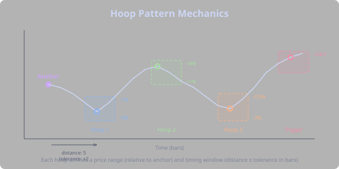

When price enters a hoop's zone within its timing window, that checkpoint is satisfied and the system advances to the next hoop. If price misses the window (too early, too late, or never reaches the price range), the pattern attempt resets.

### Example: Double Bottom

A double bottom is a W-shaped reversal pattern. Here's how to express it as hoops:

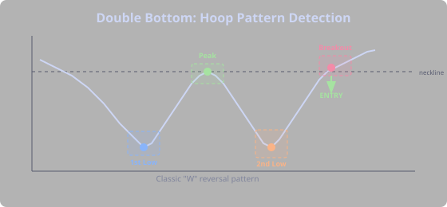

```yaml
id: double-bottom
hoops:
  - name: first-low
    minPricePercent: -3.0
    maxPricePercent: -1.0
    distance: 5
    tolerance: 2
  - name: middle-peak
    minPricePercent: 1.0
    maxPricePercent: 4.0
    distance: 7
    tolerance: 3
  - name: second-low
    minPricePercent: -3.0
    maxPricePercent: 0.5
    distance: 7
    tolerance: 3
  - name: breakout
    minPricePercent: 2.0
    maxPricePercent: null
    distance: 5
    tolerance: 3
```

Reading this: from the anchor, price drops 1-3% (first low), then rallies 1-4% (middle peak), drops back near the first low's level (second low), and finally breaks out 2%+ above the anchor (trigger). Each step has a timing window — the pattern must complete at a realistic pace, not over 500 bars.

### Combining with DSL

Hoops define the *shape* of price action. You can combine them with DSL conditions using `combineMode`:

- **`HOOP_ONLY`** — entry triggers when the hoop pattern completes
- **`DSL_ONLY`** — normal DSL condition, hoops ignored
- **`AND`** — both the hoop pattern AND the DSL condition must be true. The pattern completes, then the DSL condition is checked on the breakout bar.
- **`OR`** — either one triggers an entry

The `AND` mode is particularly useful: detect a double bottom via hoops, but only enter if `RSI(14) < 50 AND volume > AVG_VOLUME(20)` — confirming the pattern with momentum and volume.

### Tips

- **`cooldownBars`** prevents overlapping signals. After a pattern triggers, the system waits this many bars before looking for the next one. Set to 20-30 for most patterns.
- **Tolerance** controls timing precision. Wider tolerance (3-5 bars) catches more patterns; tighter (1-2) requires precise timing but produces higher-quality signals.
- **`priceSmoothingType`** helps with noisy data. Use `SMA` or `EMA` smoothing if your pattern triggers too rarely because small wicks disrupt the checkpoints. `HLC3` (average of high, low, close) is a good middle ground.
- **Start loose, then tighten.** Wide price ranges and generous tolerances find more patterns. Once you see which ones are profitable, narrow the ranges for higher-quality signals.
- **Backtest the hoop alone first** before combining with DSL. Make sure the pattern fires at reasonable places in the chart.


## Crypto Market Structure

### CEX vs DEX

Where you trade matters as much as what you trade. Crypto has two fundamentally different venue types.

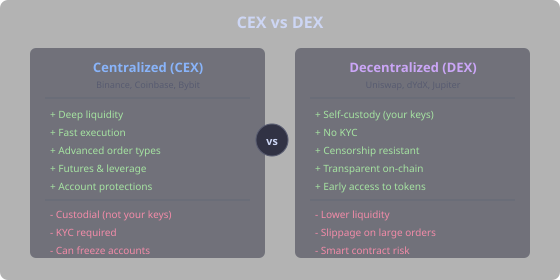

**Centralized exchanges (CEX)** — Binance, Coinbase, Bybit — work like traditional brokers. They hold your funds, match orders in a central order book, and offer advanced features like futures, leverage, and sophisticated order types. Strategy Forge backtests against CEX data (Binance) because that's where the deepest liquidity and most reliable price discovery happens.

**Decentralized exchanges (DEX)** — Uniswap, dYdX, Jupiter — run on smart contracts. You trade directly from your wallet, no intermediary holds your funds. The trade-off is thinner liquidity, slippage on larger orders, and exposure to smart contract bugs. DEX perps (like dYdX and Hyperliquid) are growing fast but still have less volume than CEX equivalents.

> **Tip:** Most serious traders use CEX for execution and DEX for tokens not available on CEX. The strategies you build in Strategy Forge target CEX pairs, but the concepts (RSI, MACD, support/resistance) work everywhere.

### Account Protections

Crypto trading has safeguards that traditional markets don't — and lacks some that traditional markets have. Understanding the differences keeps you from nasty surprises.

**What crypto has that traditional markets don't:**
- **Can't go below zero.** On a CEX, your account balance cannot go negative. Liquidation kicks in before that happens. In traditional forex or futures, you can owe your broker money if the market gaps through your stop. In crypto, the exchange eats the difference (socialized loss or insurance fund).
- **24/7 markets.** No overnight gaps. Your stop loss at $100 will actually trigger near $100, not at $85 because the market gapped down overnight. This makes technical analysis more reliable in crypto than in stocks.
- **Transparent liquidation levels.** You can see estimated liquidation prices before entering a position. The exchange tells you exactly how much pain you can take.

**What traditional markets have that crypto doesn't:**
- **Circuit breakers.** Stock exchanges halt trading when prices move too fast (5-10% in minutes). Crypto has no circuit breakers — BTC can drop 30% in an hour and nobody stops it. This is why risk management matters even more in crypto.
- **Regulatory protections.** Stock brokers are insured (SIPC in the US). If your crypto exchange gets hacked or goes bankrupt (remember FTX?), your funds may be gone. Not your keys, not your coins.
- **Guaranteed stop losses.** Some forex brokers guarantee your stop price. Crypto exchanges don't — in extreme volatility, your stop might execute at a worse price (slippage).

**Leverage in crypto vs traditional markets:**
- Crypto offers up to 125x leverage on some exchanges. Traditional futures might offer 20-50x. Higher leverage means faster liquidation — at 100x, a 1% adverse move wipes you out.
- Most experienced crypto traders use 1-5x leverage. The 100x button exists to empty the accounts of gamblers.
- Strategy Forge backtests assume spot-equivalent positioning (no leverage). If you add leverage in real trading, multiply the drawdowns accordingly.

### Fees and Costs

Trading costs are often overlooked but they compound ruthlessly, especially for active strategies.

- **Maker vs taker fees.** Limit orders (maker) are cheaper than market orders (taker). On Binance, typical fees are 0.02% maker, 0.04% taker. A strategy making 100 trades/month at 0.04% pays 4% in fees alone.
- **Funding costs.** If you hold a futures position, you pay (or receive) funding every 8 hours. At 0.01% per period, that's ~1% per month. For position traders, this cost matters.
- **Slippage.** The difference between your expected price and actual fill. Worse on illiquid pairs and during volatility. A strategy that looks profitable in backtest might not be in reality if it trades illiquid pairs.

> **Tip:** When backtesting in Strategy Forge, the default fee assumptions are conservative. If your strategy has a profit factor barely above 1.0, fees in real trading might push it below profitability. Aim for a profit factor of 1.5+ to have a comfortable margin.


## Crypto Signals

Crypto markets have unique features that traditional markets don't — perpetual futures with funding, 24/7 trading, extreme sentiment swings, and transparent on-chain data. Understanding these crypto-specific dynamics gives you edges that stock traders don't have.

### Funding Rates

In perpetual futures, **funding rates** are periodic payments between long and short holders to keep the futures price anchored to spot. This is a feature unique to crypto and one of the most useful trading signals available.

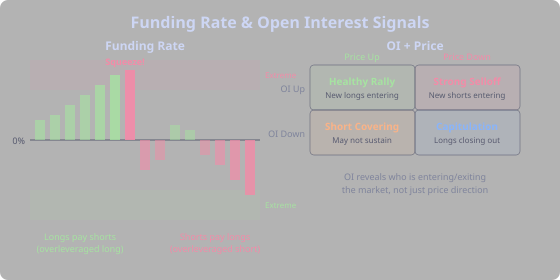

- **Positive funding** — longs pay shorts. The market is overleveraged long. Everyone and their neighbor is bullish.
- **Negative funding** — shorts pay longs. The market is overleveraged short.
- **Extreme funding** — often precedes a correction as the overleveraged side gets squeezed. When funding is 0.1%+ per 8 hours (which annualizes to 100%+), the long side is paying an unsustainable cost. A flush is coming.

**How traders use funding:**
- **Contrarian position traders** look for extreme positive funding combined with bearish technical signals — the overleveraged longs are about to get wiped.
- **Scalpers** fade funding spikes — when funding is extreme, the side paying funding is likely to capitulate soon.
- **Cash-and-carry arbitrageurs** buy spot and short futures to collect funding — a completely different strategy that profits from the funding rate itself rather than price direction.

Adjust [position sizing](tab:Strategy#position-sizing) when trading around extreme funding — smaller positions reduce exposure to the inevitable squeeze. Use `FUNDING` and `FUNDING_8H` in Strategy Forge conditions.

### Open Interest

**Open interest** is the total number of outstanding futures contracts. Changes in OI reveal who is entering and exiting the market, something price alone doesn't tell you.

- **Rising OI + rising price** — new money entering long. Trend is supported. This is the healthiest kind of rally.
- **Rising OI + falling price** — new money entering short. Downtrend is strengthening. Bears are getting aggressive.
- **Falling OI + rising price** — shorts covering (not new buying). The rally is driven by people exiting losing short positions. It often fizzles once the short covering is done.
- **Falling OI + falling price** — longs closing. Capitulation. Can signal a bottom when extreme — once everyone who wanted to sell has sold, only buyers remain.

Use `OI`, `OI_CHANGE`, and `OI_DELTA(n)` in your conditions.

### Fear & Greed Index

The Crypto Fear & Greed Index measures market sentiment on a scale of 0 (extreme fear) to 100 (extreme greed). It aggregates volatility, market momentum, social media, surveys, and BTC dominance.

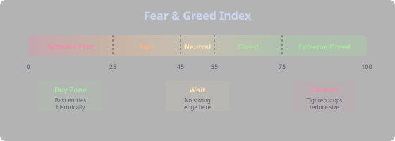

- **0-25: Extreme Fear** — the crowd is panicking. Headlines are apocalyptic. This is historically one of the best times to buy. Warren Buffett's "be greedy when others are fearful" applies perfectly.
- **25-45: Fear** — cautious market, potential accumulation zone. Smart money is buying quietly.
- **55-75: Greed** — market is optimistic, trends tend to continue. Most of a bull market is spent here.
- **75-100: Extreme Greed** — "this time is different!" is being said unironically. Market is euphoric, corrections become more likely. Not necessarily a sell signal (extreme greed can persist for weeks), but definitely time to tighten stops.

Combine with technical signals for powerful setups:

```
FEAR_GREED < 25 AND RSI(14) < 30 AND price > SMA(200)
```

This finds extreme-fear oversold conditions in an overall uptrend — historically one of the strongest buy signals in crypto. The market is panicking during what is still a bull market.

### Liquidations and Squeezes

When leveraged positions get liquidated, they create forced buying or selling that amplifies moves. This is the explosive mechanism behind crypto's violent moves.

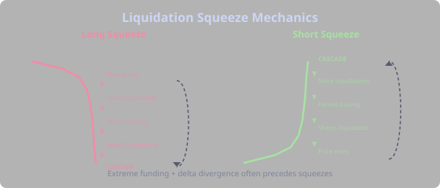

- **Long squeeze** — price drops, triggering long liquidations, which create more selling, which triggers more liquidations. A cascade. A 3% move becomes a 15% crash in minutes.
- **Short squeeze** — the mirror image. Price rises, shorts get liquidated, the forced buying pushes price higher, triggering more liquidations. This is how 20% candles happen.

Extreme funding rates combined with delta divergence often precede squeezes:
- High positive funding + negative delta = potential long squeeze. Everyone is long, but aggressive selling is emerging. When the dam breaks, the longs get washed out.
- High negative funding + positive delta = potential short squeeze. Everyone is short, but aggressive buying is emerging.

> **Tip:** Squeezes are one of the most profitable events to trade, but also one of the most dangerous to be on the wrong side of. In Strategy Forge, combine funding phases (`extreme-funding`) with delta conditions to detect squeeze setups. The key is being positioned before the cascade starts, not during it.
