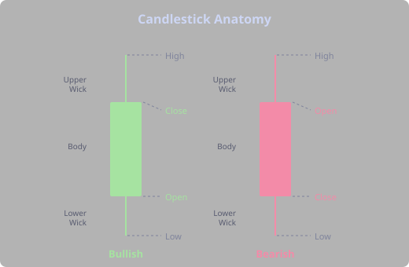
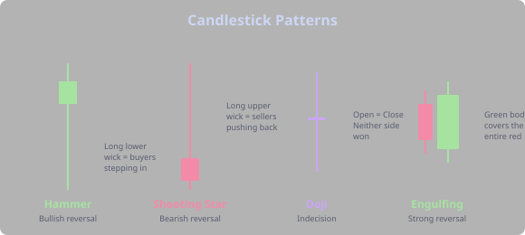
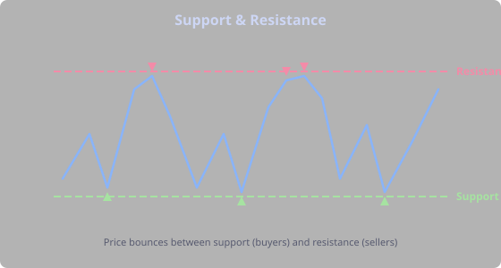
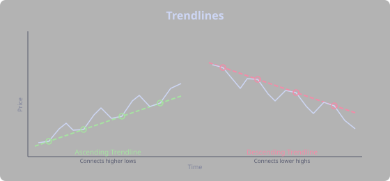
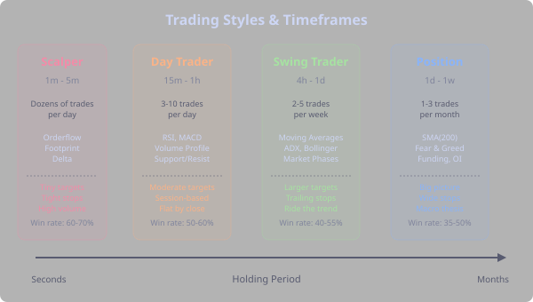

## Markets & Price

### What Is a Market?

A market is wherever buyers and sellers meet to exchange an asset at an agreed price. In crypto, this happens on exchanges like Binance, where an order book matches bids (buy orders) and asks (sell orders). The current price is simply the last price at which a trade occurred.

Every price movement reflects a shift in supply and demand. When more buyers are aggressive (hitting the ask), price rises. When sellers dominate (hitting the bid), price falls. Understanding this auction process is the foundation of all trading.

### OHLCV Candles

Price data is organized into **candles** (also called bars), each representing a fixed time period. Every candle captures five values:

- **Open** — the first trade price in the period
- **High** — the highest price reached
- **Low** — the lowest price reached
- **Close** — the last trade price in the period
- **Volume** — total amount traded during the period

A **bullish** candle (green) closes higher than it opens — buyers won the period. A **bearish** candle (red) closes lower than it opens — sellers won. The thin lines above and below the body are **wicks** (or shadows), showing the range that was rejected.

The wicks tell a story. A long lower wick means sellers tried to push price down but got overwhelmed by buyers. A long upper wick means buyers tried to push up but got rejected. Learning to read what the wicks are telling you is one of the most valuable skills in chart reading.

### Timeframes

The same market can be viewed at different timeframes. A 1-hour chart shows one candle per hour; a daily chart shows one per day. Lower timeframes (1m, 5m, 15m) reveal short-term noise. Higher timeframes (4h, 1d, 1w) show the bigger trend.

There is no "best" timeframe — it depends on your trading style. A scalper lives on the 1-minute chart and wouldn't dream of looking at the daily. A swing trader might check the daily once in the morning and not look again until evening. The timeframe you choose shapes everything: your stress level, time commitment, and what kind of edge you're looking for.

### Long and Short

**Going long** means buying, expecting price to rise. You profit from upward movement. **Going short** means selling (or borrowing and selling), expecting price to fall. You profit from downward movement.

In crypto futures, both directions are equally accessible — you can short as easily as you can go long. This is a fundamental difference from traditional stock markets, where shorting requires borrowing shares and comes with restrictions. In crypto, bears can be just as aggressive as bulls, which is why crypto markets can move violently in both directions.

## Reading Charts

### Candlestick Patterns

Individual candles and short sequences form recognizable patterns that suggest what might happen next:

- **Hammer** — small body at the top with a long lower wick. Appears in downtrends and suggests buyers are stepping in. The long wick shows sellers pushed price down but buyers drove it back up. It's the market saying "we tried going lower and nobody wanted to sell at those prices."
- **Shooting Star** — small body at the bottom with a long upper wick. Appears in uptrends and suggests sellers are pushing back. The mirror image of a hammer. The market tried going higher and got slapped down.
- **Doji** — tiny body where open and close are nearly equal. Neither side won the period. Often signals indecision before a reversal. Think of it as the market taking a breath before deciding direction.
- **Engulfing** — a candle whose body completely covers the previous candle's body. A bullish engulfing (green engulfing red) is a strong reversal signal — it says "the buyers just showed up and completely overwhelmed yesterday's sellers."

> **Tip:** No single candle pattern is reliable on its own. A hammer at a major support level after a long downtrend is a completely different signal than a hammer in the middle of nowhere. Context is everything.

### Support and Resistance

**Support** is a price level where buying pressure historically prevents further decline. **Resistance** is where selling pressure prevents further advance. These levels form because traders remember significant prices and place orders around them.

When price breaks through resistance, that level often becomes new support (and vice versa). This "polarity flip" is one of the most reliable patterns in technical analysis. Why? Because everyone who sold at resistance is now underwater and likely to buy if price comes back to that level to "break even."

Key support/resistance sources:
- Previous highs and lows
- Round numbers (e.g., $50,000 for BTC — humans love round numbers)
- Volume profile levels (POC, VAH, VAL)
- Moving averages (especially the 200-day SMA, which institutional traders watch)
- Trendlines

### Trendlines

A trendline connects two or more swing lows (uptrend) or swing highs (downtrend). The more times price respects the line, the more significant it becomes. A break of a well-established trendline often signals a trend change.

Draw trendlines using wicks (not just bodies) for accuracy, and remember: a trendline needs at least two touch points to be valid and three to be confirmed.

## Trading Styles

Not all traders are the same, and that's by design. Different personalities, risk tolerances, and lifestyles lead to fundamentally different approaches. Understanding trading styles helps you find what fits you — and recognize what doesn't.

### The Scalper

Scalpers are the sprinters of trading. They operate on 1-minute to 5-minute charts, making dozens of trades per day, each targeting tiny moves — often just a few ticks. A scalper might hold a position for 30 seconds.

**What they watch:** Orderflow, footprint charts, delta, bid/ask imbalances. They care about *who is buying and selling right now*, not what RSI says. The order book is their primary tool.

**Personality fit:** High focus, fast reflexes, comfortable with rapid decision-making. Scalpers need to be emotionally flat — there's no time to agonize over a loss because the next trade is in 10 seconds.

**Edge:** Scalpers exploit microstructure — brief imbalances between aggressive buyers and sellers that vanish in seconds. Their edge is speed and reading the tape, not predicting where price goes in a week.

**In Strategy Forge:** Scalping strategies use short timeframes (1m, 5m) with orderflow functions like `DELTA`, `IMBALANCE_AT_POC`, and `STACKED_BUY_IMBALANCES(4)`. Tight stops (0.5-1%), small targets (0.3-0.8%), and `maxOpenTrades: 1`.

### The Day Trader

Day traders work on 15-minute to 1-hour charts. They take a handful of trades each day, riding moves that last minutes to hours. The defining rule: no positions held overnight. Everything is closed before the end of their session.

**What they watch:** Support and resistance levels, volume profile (especially the previous day's POC/VAH/VAL), RSI, MACD. Day traders plan their levels before the session and then execute when price arrives.

**Personality fit:** Patient but engaged. Day traders spend their morning identifying setups and then wait — sometimes for hours — for price to reach their levels. The discipline to not trade when there's no setup separates profitable day traders from gambling ones.

**Edge:** Day traders exploit intraday patterns — the open drive, the midday lull, the US session surge. They know that 2pm UTC is a different market than 8am UTC, and they position accordingly.

**In Strategy Forge:** Day trading strategies often use session phases (`us-market-hours`, `session-overlap`) as filters. Conditions combine technical levels with momentum: `close crosses_above PREV_DAY_POC AND RSI(14) > 50`. Exit zones target the session's range.

### The Swing Trader

Swing traders work on 4-hour to daily charts. They hold positions for days to weeks, riding the "swings" between support and resistance. They might check their charts twice a day — morning and evening.

**What they watch:** Moving averages, ADX for trend strength, Bollinger Bands, market phases. Swing traders care about the trend and where they are within it. They want to buy the dips in an uptrend and sell the rallies in a downtrend.

**Personality fit:** Patient and detached. Swing traders need to stomach seeing their position go red for a day or two before the thesis plays out. They can't be glued to the screen — that leads to emotional decisions and cutting winners too early.

**Edge:** Swing traders capture multi-day trends that intraday noise obscures. A move that looks chaotic on the 15-minute chart often shows a clean setup on the daily. They profit from the fact that most retail traders are too impatient to hold through normal pullbacks.

**In Strategy Forge:** Swing strategies use higher timeframes (4h, 1d) with trend filters: `ADX(14) > 25 AND price > SMA(200)`. They use trailing stops to let winners run and required phases like `uptrend` or `golden-cross` to stay with the trend. Position sizing is smaller because stops are wider.

### The Position Trader

Position traders operate on daily to weekly charts. They make 1-3 trades per month, holding for weeks to months. They're the closest thing to investors who still actively time entries and exits.

**What they watch:** The big picture — SMA(200) for long-term trend, Fear & Greed index for sentiment extremes, funding rates for leverage positioning, macro news. A position trader might enter because "funding is at extreme levels while Fear & Greed is below 20" — conditions that play out over weeks, not minutes.

**Personality fit:** Extremely patient, high conviction. Position traders need to hold through multiple sessions of their position going against them. They also need the discipline to wait months for the right setup rather than forcing trades.

**Edge:** Position traders exploit sentiment extremes and macro cycles that shorter-term traders ignore. When everyone is panicking (extreme fear), position traders are building positions. When everyone is euphoric, they're taking profits.

**In Strategy Forge:** Position strategies use daily or weekly timeframes with sentiment filters: `FEAR_GREED < 25 AND RSI(14) < 35 AND price > SMA(200)`. Wide stops (10-15%), large targets (20-50%), and phases like `extreme-fear` or `negative-funding`.

### Finding Your Style

Most beginners start with day trading because it feels active and engaging. Many eventually migrate to swing trading when they realize that watching charts 8 hours a day leads to overtrading and exhaustion. There's no shame in being a swing trader who checks charts twice a day — many of the most profitable independent traders operate exactly this way.

> **Tip:** Your trading style should match your personality and lifestyle. If you have a full-time job, trying to scalp during work hours is a recipe for losses. Swing trading with alerts and daily chart reviews might be your edge. Strategy Forge lets you backtest across all timeframes, so you can objectively see which holding period works best for your ideas.

## Glossary

**ATH (All-Time High)** — the highest price an asset has ever reached.

**ATL (All-Time Low)** — the lowest price an asset has ever reached.

**ATR (Average True Range)** — a volatility indicator measuring the average range of price movement per period.

**Bearish** — expecting price to fall; a candle that closes lower than it opens.

**Bollinger Bands** — an overlay plotting a moving average with standard deviation bands that widen and narrow with volatility.

**Body** — the filled portion of a candlestick between the open and close prices.

**Breakout** — when price moves decisively through a support or resistance level.

**Bullish** — expecting price to rise; a candle that closes higher than it opens.

**CVD (Cumulative Volume Delta)** — a running total of delta over time, showing the aggregate balance of aggressive buying vs. selling.

**Delta** — the difference between aggressive buy volume and aggressive sell volume at a price level or within a candle.

**Drawdown** — the decline from a peak equity value to a subsequent trough, usually expressed as a percentage.

**EMA (Exponential Moving Average)** — a moving average that gives more weight to recent prices, reacting faster than an SMA.

**Entry** — the point at which a trade is opened (a position is established).

**Exit** — the point at which a trade is closed (the position is liquidated).

**Funding Rate** — periodic payments between long and short holders in perpetual futures to keep the contract price near the spot price.

**Long** — a position that profits when price rises (buying).

**MAE (Max Adverse Excursion)** — the worst unrealized loss a trade experienced before closing.

**MACD (Moving Average Convergence Divergence)** — a momentum indicator tracking the relationship between two EMAs.

**MFE (Max Favorable Excursion)** — the best unrealized profit a trade reached before closing.

**MA (Moving Average)** — a smoothed average of price over a number of periods, used to identify trend direction.

**OHLCV** — Open, High, Low, Close, Volume — the five data points captured by each candlestick.

**Open Interest** — the total number of outstanding derivative contracts (futures/options) that have not been settled.

**POC (Point of Control)** — the price level with the highest traded volume in a volume profile; acts as a magnet for price.

**Profit Factor** — gross profit divided by gross loss; above 1.0 means the strategy is profitable overall.

**R:R (Risk-Reward Ratio)** — the ratio of potential loss to potential gain on a trade (e.g., 1:2 means risking $1 to make $2).

**RSI (Relative Strength Index)** — a momentum oscillator measuring the speed and magnitude of recent price changes on a 0-100 scale.

**Sharpe Ratio** — a measure of risk-adjusted return; how much return you earned per unit of volatility.

**Short** — a position that profits when price falls (selling/borrowing and selling).

**SMA (Simple Moving Average)** — a moving average that weights all periods equally.

**Stop Loss** — a predetermined exit point that limits the loss on a trade.

**Take Profit** — a predetermined exit point that locks in a gain when price reaches a target level.

**Trailing Stop** — a stop loss that moves with price as the trade goes in your favor, locking in profit.

**VAH (Value Area High)** — the upper boundary of the price range containing a specified percentage (typically 70%) of traded volume.

**VAL (Value Area Low)** — the lower boundary of the value area.

**Wick (Shadow)** — the thin lines above and below a candlestick body, showing the high and low prices that were rejected during the period.
