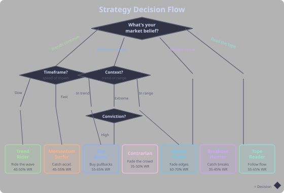
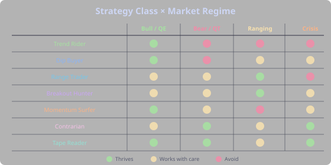

## Planning Your Strategy

Before writing a single DSL condition, answer three questions: What do you believe the market will do? How much of your day can you give it? And what data are you comfortable trading on? Your answers point to a strategy class — a proven archetype with known strengths, weaknesses, and the right tools.



## The Decision Flow

The flowchart above walks you from beliefs to a concrete strategy class. Here's how each decision node works:

### 1. What's Your Market Belief?

This is the most fundamental question. Every strategy rests on an assumption about how markets behave:

- **"Trends tend to continue"** — you believe that once a market starts moving, it's more likely to keep going than to reverse. This leads to trend-based classes (Trend Rider, Momentum Surfer).
- **"Extremes tend to revert"** — you believe that sharp moves are temporary overreactions and price returns to fair value. This leads to mean-reversion classes (Dip Buyer, Range Trader, Contrarian).
- **"Ranges eventually break"** — you believe that tight consolidation builds energy for explosive moves. This leads to the Breakout Hunter.
- **"I want to read the tape"** — you trust volume and order flow data over price patterns. This leads to the Tape Reader.

There's no wrong answer. All four beliefs are correct — in the right market conditions. The key is matching your belief to the current regime.

### 2. What Timeframe Fits Your Life?

- **Fast (1m–15m):** Requires screen time. High trade count, small targets. Best for scalpers and momentum traders.
- **Medium (1h–4h):** Check a few times per day. Balanced between trade frequency and holding time.
- **Slow (1d–1w):** Check once a day or less. Fewer trades, larger moves. Best for trend followers and contrarians.

### 3. What's Your Risk Personality?

- **"I want to win often"** — you prefer a higher win rate with smaller individual gains. Mean reversion and range trading suit you (60-70% win rate, 1-2x reward/risk).
- **"I want big wins"** — you're comfortable losing more often in exchange for occasional large payoffs. Trend following and breakouts suit you (35-50% win rate, 3-5x reward/risk).


## The Seven Strategy Classes

### 1. Trend Rider

Follow established trends using moving average alignment and trend strength. You're not trying to catch the bottom — you're joining a trend that's already confirmed and riding it until it ends.

**Signature pattern:** Price above long-term MA, trend strength confirmed, enter on pullbacks within the trend.

**Example entry:**
```
ADX(14) > 25 AND PLUS_DI(14) > MINUS_DI(14) AND price > SMA(200)
```

**Exit approach:** Trailing stop (2-3%), wide — let the trend run. Don't cut winners early.

**Phases:** Require `uptrend` or `golden-cross`. Exclude `fomc-meeting-day`.

**Best in:** Bull / risk-on macro. **Worst in:** Ranging or choppy markets.

**Win rate:** 40-50%, but winners are 2-3x losers. Profitability comes from the size of wins, not their frequency.

> See also: [Trend Following](tab:Strategy#trend-following), [ADX](tab:Indicators#adx-average-directional-index)


### 2. Dip Buyer

Buy temporary pullbacks within an intact uptrend. The trend is your friend — you're just waiting for a discount before jumping on.

**Signature pattern:** Oversold reading while the broader trend is still bullish.

**Example entry:**
```
RSI(14) < 30 AND price > SMA(200) AND ADX(14) > 20
```

**Exit approach:** Fixed TP (5-8%), tight SL (-3% to -5%). You're targeting a specific bounce, not riding a trend.

**Phases:** Require `uptrend`. Exclude `extreme-greed` (when everyone's already buying, the dip is less likely to bounce).

**Best in:** Bull markets with healthy corrections. **Worst in:** Bear markets — every dip becomes a trap.

**Win rate:** 55-65%, moderate R. Higher win rate than pure trend following because you're entering at better prices.

> See also: [Mean Reversion](tab:Strategy#mean-reversion), [RSI](tab:Indicators#rsi-relative-strength-index)


### 3. Range Trader

Fade the edges of a range — buy at support, sell at resistance within established bounds. This works because markets spend most of their time ranging, not trending.

**Signature pattern:** Price near the bottom of a defined range with no trend strength.

**Example entry:**
```
RANGE_POSITION(20) < -0.8 AND ADX(14) < 20
```

**Exit approach:** Target the opposite edge of the range (TP at `RANGE_POSITION > 0.7`), tight SL just below the range.

**Phases:** Require `ranging`. Exclude `uptrend`, `downtrend` — if a trend is forming, the range is about to break and you don't want to be fading the edges.

**Best in:** Sideways consolidation. **Worst in:** Trending markets — range breaks kill range traders.

**Win rate:** 60-70%, small-moderate R. The most consistent win rate of any class, but profits per trade are capped by the range size.

> See also: [Mean Reversion](tab:Strategy#mean-reversion), [Bollinger Bands](tab:Indicators#bollinger-bands)


### 4. Breakout Hunter

Catch new moves erupting from compressed ranges. You're looking for the moment a tightly coiled spring releases — low volatility followed by a directional explosion.

**Signature pattern:** Volatility squeeze (Bollinger Band width at multi-period lows) followed by a break above/below the bands.

**Example entry:**
```
BBANDS(20,2).width < LOWEST(BBANDS(20,2).width, 20) * 1.15 AND close > BBANDS(20,2).upper
```

**Exit approach:** Trailing stop — breakouts either run hard or fail fast. Let the winners go, cut the false breakouts quickly.

**Phases:** Exclude `ranging` (counterintuitively — you want the breakout *from* the range, not to enter during the range itself).

**Best in:** After long consolidation periods. **Worst in:** Choppy markets with frequent false breakouts.

**Win rate:** 35-45%, but winners are large (3-5x losers). Many false breakouts, but the real ones pay for all the stops.

> See also: [Breakout](tab:Strategy#breakout), [Squeeze Mechanics](tab:Advanced#volatility-squeezes)


### 5. Momentum Surfer

Ride acceleration — enter when an existing move kicks into a higher gear. Unlike trend following (which rides the whole trend), momentum trading targets the steepest, fastest part of the move.

**Signature pattern:** MACD crossover with positive histogram, confirming that momentum is not just positive but *accelerating*.

**Example entry:**
```
MACD(12,26,9).line crosses_above MACD(12,26,9).signal AND MACD(12,26,9).histogram > 0
```

**Exit approach:** Exit on momentum exhaustion (MACD histogram starts declining), or use a trailing stop. Don't hold through deceleration.

**Phases:** Require `uptrend`. Session phases like `us-market-hours` for best volatility windows.

**Best in:** Trending with volume. **Worst in:** Low-volatility chop.

**Win rate:** 45-55%, moderate-large R. A middle ground between trend following and mean reversion.

> See also: [Momentum](tab:Strategy#momentum), [MACD](tab:Indicators#macd)


### 6. Contrarian

Fade crowd extremes — buy when everyone is panicking, sell when everyone is euphoric. This requires the strongest conviction of any class because you're deliberately going against the crowd.

**Signature pattern:** Extreme fear reading combined with oversold technicals, while the long-term trend structure is still intact.

**Example entry:**
```
FEAR_GREED < 20 AND RSI(14) < 35 AND price > SMA(200)
```

**Exit approach:** Wide targets (15-30%), wide stops — these are conviction trades with long holding periods. You're betting on a regime shift, not a quick bounce.

**Phases:** Require `extreme-fear`. Exclude nothing — you *want* to trade in scary environments. That's the whole point.

**Best in:** Post-crash recovery, macro inflection points. **Worst in:** Sustained bear markets (catching falling knives).

**Win rate:** 35-50%, but winners are very large. You'll feel wrong for a long time before you're right.

> See also: [Fear & Greed](tab:Advanced#fear--greed-index), [Macro Regime](tab:Macro#dont-fight-the-macro--but-know-when-to-buy-the-fear)


### 7. Tape Reader

Follow institutional footprint — trade what the smart money is doing. This class uses orderflow data (delta, imbalances, volume profile) instead of lagging price indicators.

**Signature pattern:** Stacked buy imbalances in the footprint with positive delta, price holding above VWAP — institutional buying pressure.

**Example entry:**
```
STACKED_BUY_IMBALANCES(4) == 1 AND DELTA > 0 AND price > VWAP
```

**Exit approach:** Tight stops (1-2%), quick targets. These are precision trades — you're reading real-time flow, not predicting the future.

**Phases:** Require `us-market-hours` or `session-overlap` for liquidity. Orderflow signals are unreliable in thin markets.

**Best in:** Any regime with volume — tape reading is regime-agnostic. **Worst in:** Low-volume sessions, holidays.

**Win rate:** 55-65%, small-moderate R. High frequency, consistent edge from reading the actual market microstructure.

> See also: [Delta & Orderflow](tab:Advanced#delta-and-orderflow), [Footprint Charts](tab:Advanced#footprint-charts)


## Which Class Fits Which Market?



The matrix above gives an instant visual answer to the question: "given the current macro regime, which strategy classes should I be running?"

- **Bull / risk-on:** Trend Riders and Dip Buyers dominate. Momentum Surfers catch the acceleration phases. The trend is your friend — ride it.
- **Bear / risk-off:** Contrarians thrive at the bottom (but timing matters). Tape Readers can profit from volatility in both directions. Trend Riders and Dip Buyers get destroyed.
- **Ranging / choppy:** Range Traders own this environment. Breakout Hunters wait patiently at the edges of the range for the eventual break. Trend followers and momentum traders bleed from false signals.
- **Crisis / shock:** Contrarians (if the trigger is temporary) and Tape Readers (volatility = opportunity for flow-based strategies). Everyone else should sit on their hands.


## Combining Classes

You don't have to pick one. Running multiple strategy classes simultaneously can be more robust than relying on a single approach:

- **Complementary pairs:** A Trend Rider + Dip Buyer combination works well — one catches the main trend while the other enters on pullbacks within it.
- **Regime rotation:** Use phases to activate different strategies in different conditions. Trend Rider active when `uptrend` phase is on, Range Trader when `ranging` is on. The market picks the strategy for you.
- **Avoid conflicts:** Don't run a Trend Rider and a Range Trader on the same symbol without phase filters. They have opposite assumptions — one wants to follow the trend, the other wants to fade the edges. Without phase separation, they'll fight each other.


## From Class to Strategy

Now that you know your class, it's time to build:

1. **Pick your class** from the seven above
2. **Copy the example entry** as your starting point
3. **Set up in Strategy Forge** — create a new strategy with the entry condition, configure your backtest settings
4. **Backtest and iterate** — let the data guide your refinements, not your intuition

For the step-by-step process of building and refining a strategy, see [Your First Strategy](tab:Strategy#your-first-strategy). For how to evaluate your backtest results, see [Reading the Results](tab:Strategy#reading-the-results).
