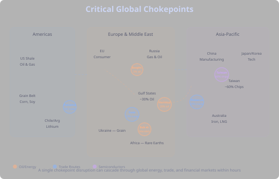
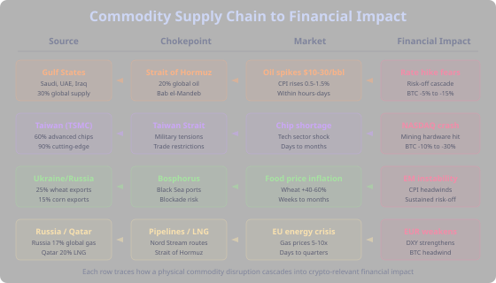

## Why Geography Matters

Technical analysis reads price. Macro analysis reads policy. But neither tells you *where* in the physical world a crisis can erupt and cascade into your portfolio within hours. Geopolitics is the bridge between the physical world and financial markets — and in crypto, those cascades are amplified by leverage, liquidations, and 24/7 trading.

The [Macro tab](tab:Macro#geopolitical-events) covers the panic-and-recovery pattern of geopolitical shocks. This section maps the *geography* — which waterways, which producers, which supply chains — so you can assess a headline's market impact before the crowd does.

Seven narrow passages control the flow of oil, goods, and semiconductors between continents. A disruption at any one of them ripples through commodity prices, inflation expectations, central bank policy, and ultimately into crypto. Understanding which chokepoint connects to which commodity is the first step in reading geopolitical risk.

## Critical Waterways

The global economy runs on ships. Over 80% of world trade moves by sea, and that trade is funneled through a handful of narrow passages. Each one is a single point of failure for a different slice of the global economy.

### Strait of Hormuz

**What flows through:** ~20% of global oil supply, ~25% of global LNG. Every barrel exported from Saudi Arabia, UAE, Iraq, Kuwait, and Qatar passes through this 21-mile-wide channel between Iran and Oman.

**Disruption impact:** An oil price spike of $10-30 per barrel within hours. Direct inflation pass-through within weeks. The most consequential chokepoint for financial markets — a full closure would be the energy equivalent of a global financial crisis.

**Historical precedent:** Iran has repeatedly threatened closure during tensions. The 2019 tanker seizures caused brief oil spikes of 4-5%. Even *threats* move oil futures, and oil futures move inflation expectations, which move rate expectations, which move crypto.

### Suez Canal

**What flows through:** ~12% of global trade, ~7% of global oil. Connects the Mediterranean to the Red Sea, providing the shortest route between Europe and Asia. Approximately 50 ships per day transit the canal.

**Disruption impact:** Shipping costs spike as vessels reroute around Africa, adding 10-14 days of transit time. Supply chains stretch, delivery timelines break, and costs ripple through every industry that depends on just-in-time manufacturing. The effects are slower than an oil shock but broader.

**Historical precedent:** The Ever Given blockage (March 2021) shut the canal for 6 days. An estimated $9.6 billion in trade was delayed per day. The 2023-24 Houthi attacks forced major shipping lines to avoid the canal entirely, increasing global shipping costs by 200-300%.

### Strait of Malacca

**What flows through:** ~25% of all global trade, ~25% of global oil shipments. The primary route connecting the Indian Ocean to the Pacific — everything flowing between the Middle East/Europe and East Asia passes through this 1.7-mile-wide channel between Malaysia and Indonesia.

**Disruption impact:** Japan, South Korea, and China are critically dependent on this strait for energy imports. A closure would strand tankers carrying oil to the world's largest manufacturing economies. Chip manufacturing in Taiwan, Korea, and Japan would face energy shortages within weeks.

**Historical precedent:** Piracy concerns in the early 2000s led to multinational naval patrols. No significant closure has occurred in modern times — which means markets haven't priced in the tail risk.

### Taiwan Strait

**What flows through:** Not primarily a trade route — its significance is geographic proximity to Taiwan, home to TSMC, which produces ~60% of the world's semiconductors and ~90% of the most advanced chips. But $5.3 trillion in annual trade also passes through the strait.

**Disruption impact:** Any military conflict would simultaneously disrupt the world's chip supply *and* one of the busiest trade corridors in Asia. The semiconductor impact alone would dwarf the 2020-2022 chip shortage. Mining hardware production would halt, tech stocks would crash, and the correlation between NASDAQ and BTC would amplify the crypto selloff.

**Historical precedent:** China's 2022 military exercises around Taiwan after Speaker Pelosi's visit briefly disrupted shipping routes. Markets sold off but recovered quickly once exercises ended. A sustained crisis would be orders of magnitude worse.

### Bab el-Mandeb

**What flows through:** ~7% of global oil, ~10% of global trade. The southern gateway to the Suez Canal — ships must pass through this strait between Yemen and Djibouti to reach Suez. Disruption here effectively closes Suez as well.

**Disruption impact:** Identical to Suez disruption but harder to resolve militarily. Yemen's coastline provides asymmetric attack capabilities (small boats, missiles, drones) that are difficult to fully neutralize.

**Historical precedent:** Houthi attacks beginning in late 2023 forced most major shipping lines to reroute around Africa. Shipping insurance premiums spiked 10x. Container rates tripled on affected routes. This was a live demonstration of chokepoint risk in real time.

### Panama Canal

**What flows through:** ~5% of global trade, ~6% of US seaborne trade. The primary shortcut between Atlantic and Pacific, critical for US agricultural exports and Asian manufactured goods heading to the US East Coast.

**Disruption impact:** Rerouting around South America adds 8-12 days of transit time. The canal's capacity is also vulnerable to drought — it depends on freshwater lakes, and low water levels restrict the number and size of ships that can transit.

**Historical precedent:** Severe drought in 2023-2024 forced the canal authority to cut daily transits from 36 to 24, then to 18. Shipping delays cascaded through supply chains. Climate risk adds a new dimension to chokepoint vulnerability.

### Bosphorus Strait

**What flows through:** ~3% of global oil supply, plus most of the grain exported from Russia and Ukraine via Black Sea ports. Also carries Russian oil exports to Mediterranean markets.

**Disruption impact:** Primarily affects grain and Russian energy exports. Turkey controls the strait and can legally restrict military vessel transit under the Montreux Convention. Grain price spikes hit emerging markets hardest, creating political instability that feeds back into global risk sentiment.

**Historical precedent:** Turkey restricted warship transit after Russia's 2022 invasion of Ukraine. Russia's Black Sea grain blockade in 2022 spiked wheat prices 40%+ and threatened food crises in Africa and the Middle East.

### The Pattern

Every chokepoint shares the same structure: narrow geography creates concentration risk. When that risk materializes, the cascade follows a predictable chain: physical disruption, commodity price spike, inflation pressure, central bank response, and finally crypto repricing. The speed varies — oil moves in hours, grain in weeks, semiconductors in months — but the direction is consistent: supply disruptions are inflationary, and inflation is a headwind for crypto. For how this pattern plays out in practice, see the [geopolitical event cycle](tab:Macro#the-pattern) in the Macro tab.

## Commodity Sources & Concentration Risk

Chokepoints are the *where* of disruption. Concentration risk is the *why* it matters — when a small number of producers supply the majority of a critical commodity, any disruption to those producers has outsized global impact.

### Oil

**Key producers:** Saudi Arabia, US, Russia (~40% of global supply combined). OPEC+ controls ~55% of production. The Gulf states alone account for ~30% of global exports.

**Why it matters for crypto:** Oil is the transmission mechanism between geopolitics and inflation. Every major oil spike has been followed by rate hike fears, which trigger risk-off moves across crypto. The chain is direct: oil up, CPI up, rate expectations up, BTC down.

### Natural Gas

**Key producers:** Russia (17% global), US, Qatar (20% LNG). Europe was ~40% dependent on Russian pipeline gas before 2022, creating an acute vulnerability.

**Why it matters for crypto:** Gas price spikes hit Europe hardest, weakening the euro and strengthening the dollar (DXY). A stronger dollar is a persistent headwind for crypto — see the [DXY correlation](tab:Macro#dollar-strength-dxy) section.

### Semiconductors

**Key producers:** Taiwan (TSMC: 60% global foundry, 90% advanced nodes), South Korea (Samsung), Netherlands (ASML lithography machines). The most concentrated critical supply chain in the world.

**Why it matters for crypto:** Chips power everything from mining hardware to the AI infrastructure that increasingly drives trading. A Taiwan crisis wouldn't just crash tech stocks — it would physically constrain BTC mining expansion and halt production of the GPUs that run trading algorithms.

### Rare Earths

**Key producers:** China (60% mining, 90% processing). Used in electronics, EVs, defense systems, and renewable energy. China has weaponized rare earth exports before (Japan 2010) and could again.

**Why it matters for crypto:** Indirect but significant. Rare earths are critical for the tech hardware that supports the entire digital asset ecosystem. Supply restrictions would be a slow-building headwind rather than an acute shock.

### Grain

**Key producers:** Russia + Ukraine (~25% global wheat exports, ~15% corn). US, Brazil, Argentina for soybeans and corn. Production is concentrated in a few breadbasket regions vulnerable to both conflict and climate.

**Why it matters for crypto:** Grain price spikes cause food inflation, particularly in emerging markets. This creates political instability, currency crises, and capital flight — some of which flows into crypto as a store of value (bullish), but the dominant effect is inflationary pressure that keeps rates higher for longer (bearish).

### Lithium

**Key producers:** Australia (mining), Chile/Argentina (reserves), China (60% processing). Critical for EV batteries and increasingly for energy storage.

**Why it matters for crypto:** The lithium-crypto link is through energy. As mining operations increasingly use battery storage and renewable energy, lithium supply disruptions could affect mining economics long-term. This is a developing connection, not yet a direct market driver.

### Concentration Risk Table

| Commodity | Top Producer | Concentration | Key Chokepoint | Disruption Speed |
|---|---|---|---|---|
| Oil | Gulf States | 30% exports | Hormuz | Hours |
| Natural Gas | Russia | 17% global | Pipelines | Days-weeks |
| Semiconductors | Taiwan | 60% chips | Taiwan Strait | Days-months |
| Rare Earths | China | 90% processing | Export controls | Weeks-months |
| Grain | Russia/Ukraine | 25% wheat | Bosphorus | Weeks |
| Lithium | Chile/Australia | 50% mining | Export policy | Months |

## How Disruptions Cascade

Understanding *that* disruptions happen isn't enough — you need to understand *how fast* and *through what channels* they reach crypto. The speed determines whether you have time to react.

### Oil Disruption Chain (Hours to Days)

The fastest cascade because oil markets are the most liquid commodity markets in the world.

1. **Physical disruption** — tanker seizure, pipeline attack, or production facility hit
2. **Oil futures spike** — within minutes of the news. Brent and WTI move immediately on any credible threat
3. **Inflation expectations shift** — bond markets reprice. Break-even inflation rates widen. Treasury yields move
4. **Rate expectations adjust** — CME FedWatch probabilities shift. If oil stays elevated, the market prices in fewer rate cuts (or more hikes)
5. **Risk-off cascade** — equities sell off on margin. USD strengthens as a safe haven. DXY rises
6. **Crypto reprices** — BTC follows the risk-off move, often with amplification from leveraged long liquidations. Altcoins drop harder

**Historical example:** The September 2019 Abqaiq drone attack on Saudi Arabia's largest oil processing facility knocked out 5.7 million barrels/day (5% of global supply). Oil spiked 15% at the next open — the largest single-day jump since 1991. Markets calmed within days as production was restored faster than expected.

### Semiconductor Disruption Chain (Days to Months)

Slower but potentially more damaging because the supply chain has no quick substitutes.

1. **Crisis trigger** — military exercise, blockade, or sanctions targeting Taiwan
2. **Tech stock selloff** — TSMC, NVIDIA, Apple, and the entire semiconductor supply chain reprice within a day
3. **NASDAQ crash** — the tech-heavy index drops, pulling growth stocks and risk assets down
4. **Crypto correlation kicks in** — BTC's correlation with NASDAQ is highest during macro stress events. A 10% NASDAQ drop historically correlates with 15-25% BTC drops
5. **Mining hardware supply freeze** — new ASIC and GPU production halts. Existing miners become more valuable but no new capacity comes online
6. **Extended uncertainty** — unlike oil, semiconductor supply cannot be restored quickly. TSMC fabs take 2-3 years to build. The overhang persists

**Historical example:** The 2020-2022 global chip shortage (triggered by COVID demand shifts, not geopolitics) caused GPU prices to triple and mining hardware to sell at 2-3x MSRP. A geopolitical disruption to Taiwan would be an order of magnitude worse.

### Grain Disruption Chain (Weeks)

The slowest cascade but the most politically destabilizing.

1. **Supply disruption** — port blockade, export ban, or crop failure
2. **Grain futures spike** — wheat, corn, and soybeans move over days as markets assess the harvest impact
3. **Food price inflation** — takes 4-8 weeks to reach consumers as existing inventories are drawn down
4. **Emerging market stress** — countries dependent on food imports face political pressure. Currency devaluation begins
5. **Capital flight to crypto** — in countries with failing currencies, some citizens convert to BTC/USDT. This is the bullish channel
6. **Global inflation headwind** — the broader CPI impact keeps central banks hawkish. This is the bearish channel

**Historical example:** Russia's Black Sea blockade in early 2022 spiked wheat prices to 14-year highs. Egypt, Lebanon, and several African nations faced food crises. The bullish-for-crypto narrative (capital flight from failing currencies) was overwhelmed by the bearish reality (global inflation keeping the Fed hawkish).

## Conflict Zones Mapped to Markets

Not all conflicts affect markets equally. What matters is proximity to the commodity supply chains described above.

### Middle East → Oil & Energy

Any conflict involving Iran, Saudi Arabia, or the Gulf states directly threatens the Strait of Hormuz. This is the highest-impact scenario for crypto because the oil-to-inflation-to-rates-to-crypto chain operates fastest here. Even proxy conflicts (Houthi attacks on shipping, Iranian-backed militia strikes on bases) create oil volatility that ripples into crypto.

### Russia-Ukraine → Energy + Grain

A dual-commodity conflict. Russian gas supply to Europe drives EU energy costs and EUR/USD dynamics. Ukrainian grain exports through the Black Sea drive global food prices. The combination creates a persistent inflationary headwind from two directions simultaneously — exactly the macro environment that's most bearish for risk assets.

### Taiwan Strait → Semiconductors & Tech

The highest-stakes but lowest-probability scenario. A full Taiwan crisis would be the most significant supply chain disruption since World War II. The semiconductor concentration risk makes this an existential threat to the tech sector, and by extension, to crypto's correlation with tech stocks and dependence on mining hardware.

### South China Sea → Trade Routes

Broader than the Taiwan Strait alone. Territorial disputes between China and its neighbors (Philippines, Vietnam, Malaysia) affect the Strait of Malacca and surrounding waters. Disruption here would affect trade flows between the Middle East and Asia-Pacific — not one commodity, but the entire logistics chain.

### Conflict-to-Market Summary

| Conflict Zone | Primary Commodity | Impact Speed | BTC Impact | Key Metric to Watch |
|---|---|---|---|---|
| Middle East / Gulf | Oil | Hours | -5% to -15% | Brent crude, DXY |
| Russia-Ukraine | Gas + Grain | Days-weeks | -5% to -10% | TTF gas price, wheat futures |
| Taiwan Strait | Semiconductors | Days-months | -10% to -30% | TSMC stock, NASDAQ |
| South China Sea | Trade routes | Weeks | -3% to -10% | Shipping rates, DXY |

## Historical Case Studies

Theory is useful, but real events teach better. These five cases illustrate how chokepoint and supply chain disruptions actually played out in markets.

### Ever Given Suez Blockage (March 2021)

**What happened:** A 400-meter container ship ran aground in the Suez Canal, blocking all traffic for 6 days. An estimated $9.6 billion per day in trade was delayed.

**Market impact:** Oil rose ~5% on the initial blockage. Shipping rates spiked. But the impact was contained because it was clearly temporary — everyone knew the ship would eventually be freed. BTC was in a bull market and barely reacted.

**Lesson:** Duration matters more than severity. A total blockage that markets expect to resolve quickly gets priced as a temporary disruption. Compare this with the Houthi attacks, where the indefinite timeline changed everything.

### Houthi Red Sea Attacks (2023-24)

**What happened:** Yemen's Houthi movement began attacking commercial shipping in the Red Sea and Bab el-Mandeb strait, forcing major shipping lines to reroute around Africa.

**Market impact:** Container shipping rates tripled on affected routes. Shipping insurance premiums spiked 10x. Global supply chains stretched by 10-14 days. Oil rose modestly but persistently. The impact was slower and more sustained than a single event — a "slow-motion Suez closure."

**Lesson:** Asymmetric threats at chokepoints can persist for months because they're militarily difficult to resolve. The market impact compounds over time through shipping costs and supply chain delays rather than spiking and fading.

### Russia Gas Cutoff (2022)

**What happened:** Russia progressively reduced and eventually halted gas pipeline flows to Europe following the Ukraine invasion and Western sanctions. Nord Stream pipelines were later sabotaged.

**Market impact:** European gas prices spiked 5-10x. EU electricity prices hit records. EUR weakened sharply against USD, pushing DXY to 20-year highs. The strong dollar was a major headwind for crypto throughout 2022, compounding the damage from Fed tightening.

**Lesson:** Energy weapon deployment creates a sustained, multi-quarter headwind — not a spike-and-recover pattern. The DXY strength from European energy vulnerability was a persistent drag on BTC throughout 2022 that many crypto traders failed to recognize.

### Abqaiq-Khurais Attack (September 2019)

**What happened:** Drone and missile strikes on Saudi Aramco's Abqaiq processing facility temporarily knocked out 5.7 million barrels/day — roughly 5% of global oil supply. The largest single disruption to oil supply in history.

**Market impact:** Oil spiked 15% at the next market open. But Saudi Arabia restored production within weeks, and oil prices returned to pre-attack levels within a month. BTC showed minimal direct reaction — it was in a crypto-specific bear market with low macro correlation.

**Lesson:** Even dramatic supply disruptions have limited market impact if they're quickly resolved. The *threat* of sustained disruption moves markets more than a brief actual disruption. The attack did, however, permanently change how markets price tail risk in Gulf oil infrastructure.

### US-China Trade War (2018-2019)

**What happened:** Not a single event but an escalating series of tariff announcements, retaliations, and negotiations. US tariffs on Chinese goods eventually reached $350 billion. China retaliated with tariffs on US agriculture.

**Market impact:** Each tariff escalation triggered risk-off moves. Each negotiation hint triggered relief rallies. BTC showed mixed reactions — sometimes correlating with risk assets, sometimes acting as a hedge against trade uncertainty. The overall effect was a persistent cloud of uncertainty that suppressed global growth expectations.

**Lesson:** Prolonged geopolitical uncertainty is more damaging to markets than acute shocks. Markets can price a missile strike; they can't price an open-ended trade conflict. The uncertainty premium persists and suppresses risk appetite across all asset classes.

## Trading Geopolitical Risk

Knowing the geography and supply chains isn't enough — you need a framework for translating headlines into trading decisions.

### Five-Step Framework

**Step 1: Identify the chokepoint or supply chain.** When a geopolitical headline breaks, the first question is: does this threaten a critical commodity flow? If yes, which one? If no (e.g., domestic politics in a non-producer nation), the market impact is likely limited to sentiment.

**Step 2: Assess the duration.** Is this a temporary disruption (ship blockage, military exercise) or a structural shift (war, sanctions regime, trade policy change)? Temporary disruptions create trading opportunities on the recovery. Structural shifts require strategy adaptation.

**Step 3: Trace the cascade.** Follow the chain: physical disruption, commodity price, inflation, central bank response, crypto impact. The speed depends on the commodity — oil is hours, semiconductors are days, grain is weeks.

**Step 4: Check the macro context.** The same geopolitical event has different impacts depending on the broader environment. An oil spike during a rate-cutting cycle is absorbed much more easily than during a rate-hiking cycle when inflation is already elevated. See the [macro regime framework](tab:Macro#reading-macro-as-a-crypto-trader).

**Step 5: Size the position appropriately.** Geopolitical events have fat tails — the worst case is always worse than expected. Use [conservative position sizing](tab:Strategy#position-sizing) and accept that some events will blow through your stop loss before you can react.

### Strategy Forge Integration

Use Strategy Forge's built-in tools to systematically filter for geopolitical risk:

**Phase filters:** The [phase system](tab:Advanced#the-phase-system) lets you exclude trading during high-risk periods. FOMC meeting phases are built in. For geopolitical risk, you can create custom phases that activate when oil volatility or DXY momentum exceed thresholds — effectively pausing your strategy when geopolitical stress is elevated.

**Fear & Greed filtering:** The [Fear & Greed Index](tab:Advanced#fear--greed-index) captures the sentiment impact of geopolitical events. Extreme fear (below 25) after a geopolitical shock is historically a contrarian buy signal — but only if the disruption is temporary. Use `FEAR_GREED < 25 AND FEAR_GREED_AVG(7) < 30` as a phase condition to identify sustained fear periods where the crowd has likely overreacted.

**Volatility awareness:** ATR-based position sizing automatically reduces your exposure when geopolitical events spike volatility. Pair this with phase filters to both reduce position size and filter entries during high-stress periods.

Geopolitical risk can't be backtested the way technical indicators can — each event is unique. But the *patterns* of how disruptions cascade through markets are consistent enough to build systematic filters around. The goal isn't to predict geopolitical events; it's to ensure your strategy degrades gracefully when they occur, and positions you to capitalize on the recovery.
