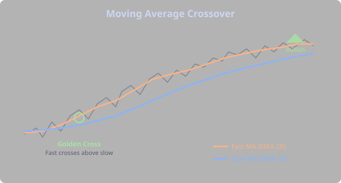
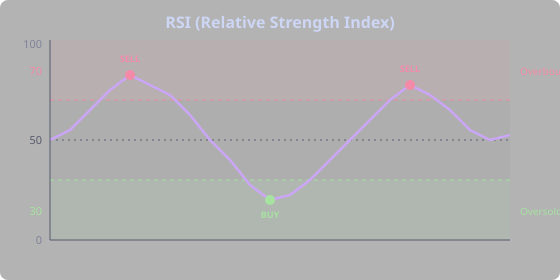
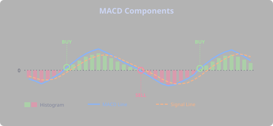
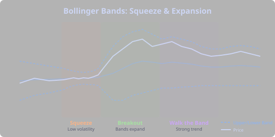
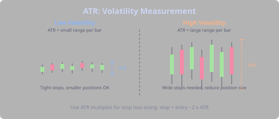
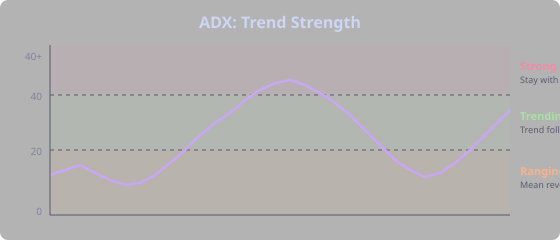
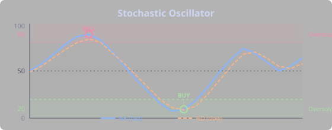
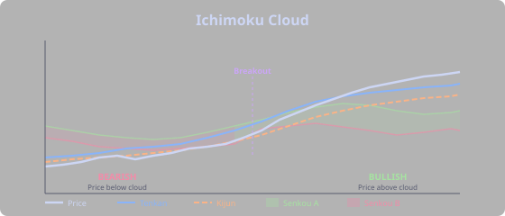

## Technical Indicators

Indicators are mathematical calculations applied to price and volume data. They help quantify what the chart is showing and remove some subjectivity from analysis. But remember: indicators are derived from price. They don't predict the future — they describe the present and recent past in different ways.

### Moving Averages

A **moving average** smooths price over a period, showing the average trend direction. Two main types:

- **SMA (Simple Moving Average)** — equal weight to all periods. `SMA(200)` is the average of the last 200 closes. It's slow to react, which is the point — it filters out noise and shows the true trend.
- **EMA (Exponential Moving Average)** — more weight on recent prices, reacts faster to changes. Better for shorter-term signals but more prone to false signals.

**Key signals:**
- Price above its moving average = bullish bias
- Price below = bearish bias
- **Golden Cross** — short MA (e.g., 50) crosses above long MA (e.g., 200). Bullish signal. Institutional traders pay attention to this on the daily chart.
- **Death Cross** — short MA crosses below long MA. Bearish signal.

Common periods: 20 (short-term, what day traders watch), 50 (medium, swing trader territory), 200 (the long-term trend line that the entire market respects).

> **Tip:** The 200-day SMA is arguably the most important line on any chart. In crypto bull markets, BTC almost always stays above it. A sustained break below often signals a regime change. Use `price > SMA(200)` as a trend filter in your strategies.

### RSI (Relative Strength Index)

RSI measures momentum on a scale of 0 to 100. It compares the magnitude of recent gains to recent losses.

- **Above 70** — overbought. Price may be overextended to the upside.
- **Below 30** — oversold. Price may be overextended to the downside.
- **Divergence** — when price makes a new high but RSI makes a lower high, it suggests weakening momentum (bearish divergence). This is one of the most powerful signals in technical analysis — it means price is rising on fumes.

RSI works best in ranging markets. In strong trends, RSI can stay overbought or oversold for extended periods — a common trap for beginners who short every RSI reading above 70 in a bull market.

**How different traders use RSI:**
- **Mean reversion trader:** Buys when RSI drops below 30 in an uptrend. The "oversold bounce" is their bread and butter.
- **Momentum trader:** Buys when RSI crosses above 50 from below — momentum turning bullish. They don't care about overbought; in a trend, RSI above 50 is bullish.
- **Swing trader:** Uses RSI divergence to time exits. If their long position is profitable and RSI shows bearish divergence, they tighten stops.

### MACD (Moving Average Convergence Divergence)

MACD tracks the relationship between two EMAs (typically 12 and 26 period). It has three components:

- **MACD Line** — the difference between the two EMAs
- **Signal Line** — an EMA of the MACD line (typically 9 period)
- **Histogram** — the difference between MACD and Signal lines

**Key signals:**
- MACD crossing above Signal = bullish momentum
- MACD crossing below Signal = bearish momentum
- Histogram growing = momentum accelerating
- Histogram shrinking = momentum weakening (early warning, even before a cross)

MACD is a favorite of swing traders because it confirms trends without being too noisy. A MACD cross on the daily chart is a significant event. On the 5-minute chart, it happens so often it's nearly useless.

### Bollinger Bands

Bollinger Bands plot a moving average with bands at a set number of standard deviations above and below (typically 2). They adapt to volatility — bands widen in volatile markets and narrow in quiet ones.

- **Squeeze** — bands narrow significantly, indicating low volatility. Often precedes a breakout. Breakout traders live for the squeeze — they set alerts for when `BBANDS(20,2).width` hits a 50-period low and then wait for the explosive move.
- **Walk the band** — price staying near the upper or lower band in a strong trend. This is not a reversal signal — it means the trend is strong.
- **Mean reversion** — price returning to the middle band after touching an outer band. Range traders use this: buy at the lower band, sell at the upper band, but only when ADX confirms the market is actually ranging.

### ATR (Average True Range)

ATR measures volatility — how much price typically moves per period. It does not indicate direction, only the magnitude of movement.

This is one of the most underappreciated indicators. Most beginners ignore it; experienced traders consider it essential.

Uses:
- **Stop loss sizing** — set stops at a multiple of ATR (e.g., 2x ATR below entry). This means your stop automatically widens in volatile markets and tightens in calm ones — exactly what you want.
- **Position sizing** — smaller positions when ATR is high (volatile market). If ATR doubled, you should halve your position size to maintain the same dollar risk.
- **Trade filtering** — some traders only trade when ATR is above its average (volatility expanding = bigger moves = more profit potential).

### ADX (Average Directional Index)

ADX measures trend strength (not direction) on a scale of 0 to 100.

- **Below 20** — no trend (ranging market). Mean reversion strategies work best. Trend followers should sit on their hands.
- **20-40** — trending. Trend-following strategies work best. Mean reversion traders should be cautious.
- **Above 40** — strong trend. Stay with the trend, avoid counter-trend trades entirely.

The companion indicators +DI and -DI show direction: +DI > -DI means bullish trend, -DI > +DI means bearish.

> **Tip:** ADX is the ultimate "which strategy type should I use right now?" indicator. If you build two strategies — one trend-following, one mean reversion — use ADX phases to activate the right one for current conditions.

### Stochastic Oscillator

The Stochastic oscillator is another momentum tool, but it works differently from RSI. Instead of comparing gains to losses, it measures where the current close sits relative to the high-low range over a period. The result is two lines: %K (the fast line) and %D (a smoothed version of %K), both on a 0-100 scale.

- **Above 80** — overbought. Price is near the top of its recent range.
- **Below 20** — oversold. Price is near the bottom of its recent range.
- **%K crossing above %D in the oversold zone** — classic buy signal. The fast momentum is turning up while price is still cheap.
- **%K crossing below %D in the overbought zone** — sell signal. Momentum fading at the top.

Where RSI excels in trending markets (confirming momentum), Stochastic shines in ranging markets. It's more sensitive to short-term swings, which makes it better at catching turns within a range — and worse at staying out of trouble during strong trends, where it spends long periods stuck in overbought or oversold territory.

**How different traders use Stochastic:**
- **Range traders** use %K/%D crossovers in the extreme zones as their primary signal. Buy the oversold cross, sell the overbought cross, repeat.
- **Swing traders** combine Stochastic with ADX: only take Stochastic signals when ADX < 25 (ranging market), switch to trend tools when ADX rises.
- **Confirmation traders** use it as a second opinion alongside RSI — if both are oversold and crossing up, the signal is stronger.

DSL: `STOCHASTIC(14).k`, `STOCHASTIC(14).d`

### Supertrend

Supertrend is a trend-following indicator built on ATR. It draws a single line that flips between support (below price in an uptrend) and resistance (above price in a downtrend). When price crosses the line, the trend flips. No ambiguity, no interpretation — it's either bullish or bearish.

This simplicity is its greatest strength. Moving average crossovers require choosing two periods and interpreting their relationship. Supertrend gives you a binary answer: trend is up (1) or down (-1). It also provides dynamic support and resistance levels that adapt to volatility through ATR.

**How different traders use Supertrend:**
- **Trend followers** use `SUPERTREND(10,3).trend == 1` as a broad filter — only take longs when Supertrend is bullish, only shorts when bearish. It keeps you on the right side of the market.
- **Swing traders** use the flip as an entry signal. When Supertrend flips from -1 to 1, that's a trend change — enter long with a stop at the Supertrend lower level.
- **Multi-timeframe traders** run Supertrend on the daily for direction, then use it on the 1h for entries. Daily bullish + 1h flipping bullish = high-conviction long.

Higher multiplier values (e.g., 3 or 4) make Supertrend less sensitive — fewer flips, bigger trends captured. Lower values (e.g., 1.5 or 2) flip more often, catching smaller moves but generating more false signals.

DSL: `SUPERTREND(10,3).trend`, `SUPERTREND(10,3).upper`, `SUPERTREND(10,3).lower`

### Ichimoku Cloud

Ichimoku Kinko Hyo ("one glance equilibrium chart") is a Japanese charting system that packs five components into a single view. It looks intimidating at first — there's a lot on screen — but once you understand the pieces, it gives you trend direction, momentum, and support/resistance all at once.

The five components:
- **Tenkan-sen** (conversion line) — the midpoint of the last 9 periods. Acts like a fast moving average.
- **Kijun-sen** (base line) — the midpoint of the last 26 periods. Acts like a slow moving average.
- **Senkou Span A** — the average of Tenkan and Kijun, plotted 26 periods ahead. One edge of the "cloud."
- **Senkou Span B** — the midpoint of the last 52 periods, plotted 26 periods ahead. The other cloud edge.
- **Chikou Span** — the current close plotted 26 periods back. A confirmation tool.

The **cloud** (kumo) between Senkou A and B is the key feature. Price above the cloud = bullish. Price below = bearish. Price inside the cloud = indecision, stay out. A thick cloud means strong support/resistance; a thin cloud is easier to break through.

**Tenkan crossing above Kijun** is a buy signal (like a golden cross but with Ichimoku's own periods). The strongest signals happen when this cross occurs above the cloud — trend, momentum, and support all aligned.

DSL: `ICHIMOKU().tenkan`, `ICHIMOKU().kijun`, `ICHIMOKU().senkou_a`, `ICHIMOKU().senkou_b`, `ICHIMOKU().chikou`

### Range Position

Range Position is a simple but powerful indicator that answers one question: where is price within its recent range? It maps the current price to a scale from -1 (at the period low) to +1 (at the period high), with 0 being the midpoint.

Think of it as a normalized version of "how high or low are we?" If `RANGE_POSITION(20)` returns -0.9, price is near the bottom of its 20-period range. If it returns +0.9, you're near the top.

**How different traders use Range Position:**
- **Mean reversion traders** love it. Buy when `RANGE_POSITION(20) < -0.8`, sell when `> 0.8`. It's the purest expression of "buy low, sell high" within a defined range.
- **Breakout traders** use it as a filter — if Range Position is near 0, price is mid-range and a breakout is less likely. Wait for it to approach an extreme before looking for a breakout signal.
- **Multi-indicator traders** combine it with ADX: if ADX < 20 (ranging) and Range Position < -0.8 (near range bottom), that's a high-probability mean reversion buy.

The optional `skip` parameter lets you ignore the most recent bars: `RANGE_POSITION(20, 5)` calculates the range from 20 bars ago to 5 bars ago, then checks where the current price sits within that range. This avoids the range being defined by the very move you're trying to trade.

DSL: `RANGE_POSITION(20)`, `RANGE_POSITION(20, 5)`
