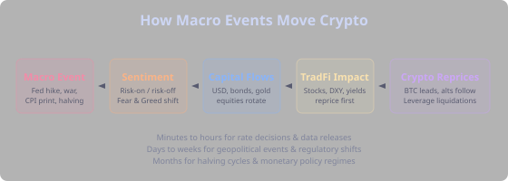
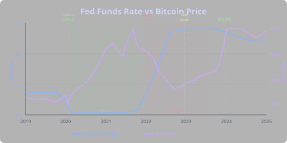
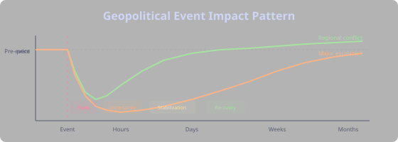
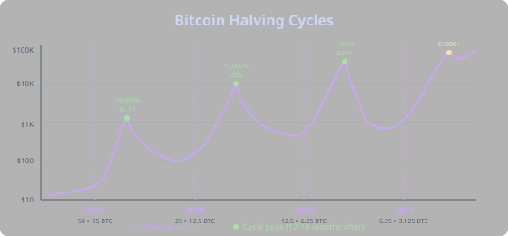
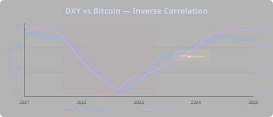
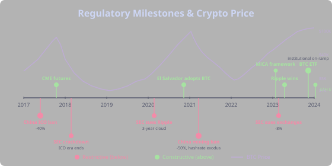
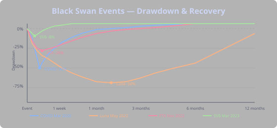

## Why Macro Matters

Technical analysis tells you *what* price is doing. Macro tells you *why*. Macro events create the tide that lifts or sinks all boats — a perfect RSI setup means nothing if the Fed just hiked 75 basis points.

Traders who only read charts get blindsided by events that render technical signals irrelevant. The best crypto traders understand both: they use technicals for timing and macro for direction. This section covers the macro forces that drive crypto markets, from central bank policy to black swan events.

A single macro event cascades through the financial system: it shifts sentiment, redirects capital flows, reprices traditional assets, and eventually hits crypto — often amplified by leverage and liquidations. The speed varies: rate decisions move markets in minutes, geopolitical events play out over days, and halving cycles unfold across months.

## Central Bank Policy

The most powerful force in markets. When the Federal Reserve speaks, every asset class listens — including crypto.

### Interest Rates

Higher interest rates mean expensive capital. When borrowing costs rise, investors pull money from risky assets and park it in safe ones — treasury bonds suddenly pay 5%, so why hold volatile crypto? This is the "risk-off" trade. Lower rates reverse the flow: cheap money floods into risk assets, and crypto benefits enormously.

The 2020-2021 bull run wasn't just crypto enthusiasm — it was the Fed cutting rates to zero and pumping trillions into the economy. When that same Fed started hiking aggressively in 2022, the crypto winter wasn't a coincidence.

### Quantitative Easing & Tightening

**Quantitative easing (QE)** is when the Fed buys bonds, injecting money into the financial system. More dollars chasing the same assets means prices go up — especially for scarce assets like Bitcoin. The 2020-2021 QE program fueled the biggest crypto bull run in history.

**Quantitative tightening (QT)** is the reverse: the Fed sells bonds, draining liquidity from markets. Less money in the system means less money flowing into crypto. The 2022 QT program coincided with crypto's worst bear market since 2018.

The lesson is simple: follow the liquidity. When central banks are printing, crypto tends to rally. When they're draining, crypto tends to struggle.

### Forward Guidance

Markets move on *expectations*, not decisions. If traders expect a 25bp rate cut and the Fed delivers 50bp, that's bullish — even though rates are still historically high. Conversely, a widely expected rate cut that actually happens can be a "sell the news" event because it was already priced in.

**How to trade it:** Watch CME FedWatch probabilities for rate expectations. Crypto often front-runs the actual decision by days or weeks. The move happens when expectations shift — a single Fed governor's speech can move markets more than the actual rate decision if it changes the outlook.

Strategy Forge's [FOMC calendar phases](tab:Advanced#the-phase-system) can automatically filter your strategy around Fed meetings, keeping you out of the volatility hurricane or positioning you to capture the move.

### Inflation & Economic Data

**CPI (Consumer Price Index)** is the number everyone watches. Hot CPI means inflation is sticky, rates stay higher for longer, and that's risk-off for crypto. Cool CPI means rate cuts are coming closer, and that's risk-on.

**Jobs data (Non-Farm Payrolls)** drops the first Friday of each month. Strong jobs mean the economy is hot, which means the Fed stays hawkish. Weak jobs mean the Fed may need to cut rates sooner.

**"Good news is bad news"** — in a hiking cycle, a strong economy gives the Fed reason to keep tightening. Traders actually cheer bad economic data because it brings rate cuts closer. This counterintuitive dynamic confuses new traders, but once you understand the Fed's reaction function, it makes perfect sense.

## Geopolitical Events

Wars, conflicts, and political crises create immediate uncertainty — and markets hate uncertainty more than bad news.

### The Pattern

Almost every geopolitical shock follows the same playbook:

1. **Initial panic** — risk-off across the board. Stocks and crypto dump. USD, gold, and treasuries rally as capital seeks safety.
2. **Uncertainty phase** — markets assess the scale and duration. Volatility stays elevated. Leveraged positions get liquidated.
3. **Stabilization** — the worst-case scenario either materializes (and gets priced in) or doesn't. Markets find a floor.
4. **Recovery** — once the uncertainty premium fades, risk assets bounce. Often to levels higher than before the event.

### Duration Matters

Short conflicts produce V-shaped recoveries within weeks. Prolonged wars create sustained headwinds that suppress risk appetite for months. The key question isn't "what happened?" but "how long will uncertainty persist?"

### Historical Examples

**Russia-Ukraine (Feb 2022):** BTC dropped 8% in days, but the war amplified an existing downtrend from Fed tightening. The war was a catalyst, not the cause.

**Israel-Hamas (Oct 2023):** Brief crypto dip, recovered within days. Markets increasingly price in geopolitical risk faster as these events become more frequent.

**US-China trade tensions (2018-2019):** Not a single shock but prolonged uncertainty. Created a persistent headwind for risk assets rather than a dramatic crash and recovery.

### Bearish vs Bullish Geopolitical Events

Not all geopolitical events are bearish for crypto. The initial reaction is almost always risk-off, but the medium-term impact depends on *what kind* of event it is.

| Event Type | Direction | Why | Examples |
|---|---|---|---|
| Military conflict near energy | Bearish | Oil spikes → inflation → rate hike fears | Russia-Ukraine, Gulf tensions |
| Trade wars / sanctions | Bearish | Supply chain disruption, growth fears | US-China tariffs, Russia sanctions |
| Nuclear/escalation threats | Bearish | Extreme risk-off, flight to USD | North Korea tests, Taiwan tensions |
| Banking / sovereign crisis | Bullish | "Unbank yourself" narrative, capital flight | SVB collapse, Cyprus bail-in, Greek crisis |
| Currency collapse | Bullish | Local populations flee to BTC as store of value | Turkey lira crisis, Argentina peso, Lebanon |
| Sanctions on citizens | Bullish | Censorship-resistant money demand spikes | Russia capital controls, Nigeria restrictions |
| Political instability in West | Mixed | Uncertainty bearish short-term, but weakens USD → bullish | Brexit, US election uncertainty |

The pattern: events that threaten the traditional financial system's stability tend to be bullish for crypto on a longer timeframe, even if the initial reaction is a sell-off. Events that tighten global financial conditions (wars → oil → inflation → rates) are persistently bearish.

### The Energy Link

Wars near oil-producing regions spike energy prices. Higher oil means higher inflation, which means rate hike fears, which means risk-off for crypto. Russia-Ukraine drove this chain clearly: oil spiked, inflation surged, the Fed hiked aggressively, and crypto crashed.

**"Buy the invasion"** — historically, markets bottom near the start of conflict and recover. Fear of war is worse than war itself for markets. But this is a tendency, not a rule — position size accordingly.

## Bitcoin Halving Cycles

The halving is the most predictable macro event in crypto: every ~4 years, the block reward gets cut in half. Less new BTC entering circulation while demand stays constant or grows creates a supply squeeze.

### The Four Halvings

**2012 halving** ($12 → $1,100): The first halving. Few participants, thin markets. A 9,000%+ rally that put Bitcoin on the map. Most people didn't know what Bitcoin was.

**2016 halving** ($650 → $20,000): The ICO boom amplified the supply squeeze. Retail mania drove the blow-off top. The subsequent 84% crash took over a year to bottom.

**2020 halving** ($8,700 → $69,000): Institutional adoption met QE-fueled liquidity. MicroStrategy, Tesla, and fund managers validated Bitcoin as an asset class. The rally was more orderly but ultimately ended with the same pattern.

**2024 halving**: The first post-ETF halving. Different dynamics with institutional demand through ETFs absorbing new supply. The playbook may be evolving, but the fundamental supply reduction is the same.

### The Diminishing Returns Debate

Each cycle's percentage gain has decreased as the market matures. 9,000% → 3,000% → 700%. But even "diminished" returns of 200-300% from a higher base are massive in absolute terms. Whether this trend continues or the ETF era breaks the pattern is one of crypto's most debated questions.

### How to Trade It

The rally tends to materialize 12-18 months after the halving — not instantly. The supply reduction takes time to create a meaningful squeeze. Position in the months before (accumulation phase) using longer timeframes (1d, 1w) with [trend-following strategies](tab:Strategy#trend-following). Don't expect the halving date itself to be the catalyst — it's already priced in. The rally comes from sustained supply reduction meeting demand that builds gradually.

## Dollar Strength (DXY)

The US Dollar Index (DXY) measures the dollar against a basket of major currencies. It's one of the most reliable macro indicators for crypto direction.

### The Inverse Relationship

Crypto is priced in USD. When the dollar strengthens (DXY rises), each dollar buys more Bitcoin — but more importantly, a strong dollar signals risk-off conditions globally. Capital flows back to the safety of USD, draining liquidity from risk assets including crypto.

When the dollar weakens, the opposite happens: the inflation hedge narrative strengthens, capital seeks returns outside USD, and crypto benefits from the liquidity tailwind.

### Why It Matters Beyond Pricing

- **Weak dollar** → inflation hedge narrative strengthens → BTC demand rises as a store of value
- **Strong dollar** → risk-off globally → capital flows back to USD → crypto sells off
- **Emerging market impact** → when DXY rises, EM currencies weaken → reduces global crypto buying power since most retail crypto traders are outside the US

### When the Correlation Breaks

In extreme crypto-specific events (ETF approval, exchange collapse), crypto decouples from DXY temporarily. The BTC ETF approval in January 2024 drove prices higher even as DXY was relatively stable. But these divergences are temporary — the correlation reasserts over weeks or months as the macro environment dominates again.

### Practical Use

Watch DXY for macro confirmation. If your technical setup says buy but DXY is breaking out to new highs, the macro headwind may override your signal. Conversely, a weakening DXY provides a tailwind that makes technical breakouts more likely to sustain.

## Crypto Regulatory Milestones

Regulation is crypto's most emotional topic — and one of its most powerful price drivers.

### China Bans (2017, 2021)

Each Chinese ban crashed prices 30-50%. The 2017 ICO ban killed the token sale mania. The 2021 mining ban forced a massive hashrate migration to North America. But both times, crypto recovered and moved to other jurisdictions. The bans progressively mattered less as the ecosystem decentralized — by 2021, the market was sophisticated enough to absorb the shock in months rather than years.

### SEC vs Ripple (2020-2023)

The lawsuit that defined how US securities law applies to crypto tokens. Three years of uncertainty weighed on the entire altcoin market. Ripple's partial victory in 2023 was hugely bullish — not just for XRP, but for every token worried about being classified as a security.

### Bitcoin ETF Approval (January 2024)

The most anticipated event in crypto history. Classic "buy the rumor, sell the news" — BTC rallied into the approval, dipped on the day, then continued higher as institutional flows built up over weeks and months. The ETF changed crypto's structure fundamentally: institutional capital now has a regulated on-ramp that didn't exist before.

### Ethereum ETF (2024)

Followed a similar pattern but with less dramatic impact — the playbook was already known. Markets are efficient; the surprise value of the second ETF was lower.

### MiCA (Europe)

The EU's comprehensive regulatory framework. Rather than banning or restricting, it provided clear rules. The market response was positive — institutional confidence comes from clarity, even when individual regulations seem restrictive.

### The Trading Lesson

Regulatory clarity is bullish even when individual regulations seem restrictive. Markets hate uncertainty more than bad news. A clear "you can operate under these rules" is better for prices than a vague "we might ban this someday." Watch for regulatory shifts as macro signals — new frameworks often mark the beginning of institutional adoption waves.

## Black Swan Events

Every black swan felt like "crypto is dead" at the time. Every one was followed by new highs eventually. But the path through was brutal.

### COVID Crash (March 2020)

BTC dropped 50% in two days — the fastest crash in its history. Everything correlated to one: stocks, bonds, gold, crypto all crashed together as markets seized up. Then the fastest recovery in history — back to pre-crash levels in 2 months — as central banks responded with unprecedented stimulus.

**Lesson:** Extreme panic selling creates extreme buying opportunities, especially when the trigger is temporary and central banks respond with liquidity. The [extreme fear](tab:Advanced#the-phase-system) phase that followed was one of the best buying signals in crypto history.

### Terra/Luna Collapse (May 2022)

$40 billion wiped out in days when the UST algorithmic stablecoin broke its peg. Contagion spread to Three Arrows Capital, Celsius, and Voyager — a cascade of crypto-native leverage unwinding. BTC dropped from $40K to $17K over the following months.

**Lesson:** No technical indicator warned of this — it was a fundamental credit event. Crypto-native leverage and bad tokenomics can create cascading failures that look nothing like normal market drawdowns. Diversification across the crypto ecosystem matters.

### FTX Collapse (November 2022)

Crypto's Lehman moment. The second-largest exchange collapsed from fraud and mismanagement. BTC dropped from $21K to $15.5K. Unlike Luna, recovery was faster because the contagion was contained — the leverage had already been flushed out earlier in 2022.

**Lesson:** Exchange risk is existential — not a technical analysis problem. Also: the extreme fear following FTX marked the bottom of the 2022 bear market. The [Fear & Greed Index](tab:Advanced#fear--greed-index) below 10 was followed by a 300%+ rally over the next year.

### SVB Banking Crisis (March 2023)

A traditional bank failure was ironically bullish for crypto. The "unbank yourself" narrative strengthened, and fears of broader banking contagion drove capital toward decentralized alternatives. BTC rallied 40% in a month.

**Lesson:** Crypto's response to events isn't always intuitive. A banking crisis that would seem bearish for all risk assets actually strengthened Bitcoin's value proposition as an alternative to the traditional financial system.

### The Common Thread

Every black swan was followed by new highs, but many leveraged traders didn't survive to see the recovery. The traders who profited from these events were the ones with conservative [position sizes](tab:Strategy#position-sizing) and the cash to buy when everyone else was forced to sell.

## Reading Macro as a Crypto Trader

Macro doesn't replace your technical strategy — it provides context that makes your strategy smarter.

### Build a Macro Calendar

Track Fed meetings, CPI release dates, NFP Fridays, options expiries, and halving countdowns. Strategy Forge's [calendar phases](tab:Advanced#the-phase-system) automate FOMC and holiday filtering, keeping your strategy out of the most dangerous volatility windows. For everything else, awareness is your edge — you don't need to predict the number, just know when the number drops.

### Understand the Regime

Is the Fed easing or tightening? That single factor explains most of crypto's macro moves over any 6-12 month period. In an easing cycle, buy-the-dip strategies work beautifully. In a tightening cycle, those same strategies bleed slowly as each bounce is lower than the last.

### Don't Fight the Macro — But Know When to Buy the Fear

"Don't fight the macro" and "buy when there's blood in the streets" are both classic trading wisdom — and they seem to contradict each other. The resolution is that they apply to different traders in different situations. The question isn't which rule is right; it's which rule applies *to your strategy right now*.

**The framework: trend vs regime change.** "Don't fight the macro" applies when the macro regime is established and ongoing. A Fed hiking cycle that started 6 months ago isn't a buying opportunity — it's a headwind that grinds for quarters. "Buy the blood" applies at inflection points — moments of acute panic where the macro backdrop is about to shift, or where the event is temporary and the market is overreacting.

The distinction maps directly to trading style:

| Your Strategy | Macro Risk-Off Regime | Acute Panic Event |
|---|---|---|
| **Trend follower** (1h-4h) | Sit out or reduce size. The trend is down and your signals will keep losing. Don't fight it. | Wait for the dust to settle. Enter when your indicators confirm a reversal, not during the crash. |
| **Swing trader** (4h-1d) | Tighten stops, reduce position size, or switch to mean-reversion setups that profit from chop. | Selective buying if technical structure holds (e.g., price holds SMA(200) on the weekly despite the panic). |
| **Position trader** (1d-1w) | This is your domain. Accumulate slowly during the fear, but only if the *fundamental trigger* is temporary. | Back up the truck — but only with position sizes you can hold through another 30% drop. |
| **Scalper** (1m-5m) | Doesn't matter much. Scalpers trade volatility in both directions. Risk-off actually creates *more* scalping opportunities. | Trade the bounce, trade the breakdown — volatility is a scalper's friend. |

**The key question to ask yourself:** Is the macro headwind *structural* (rate hiking cycle, sustained dollar strength, prolonged war) or *episodic* (surprise CPI print, one-off geopolitical scare, exchange collapse)? Structural headwinds mean don't fight it — adapt your strategy or reduce exposure. Episodic shocks mean the panic will pass — and if you have the conviction and the capital, buying the fear is how generational returns are made.

**Practical example:** In March 2022, a trend follower buying RSI dips was fighting the macro — the Fed had just started hiking and DXY was strengthening. Each dip was a lower high. But in November 2022 after FTX collapsed, a position trader buying extreme fear was *buying the inflection* — the Fed was approaching peak rates, the worst of the leverage unwind was over, and Fear & Greed was in single digits. Same "blood in the streets," completely different macro context, completely different correct action.

### Use Sentiment as Confirmation

The [Fear & Greed Index](tab:Advanced#fear--greed-index) below 25 during a macro panic is historically a strong buy signal — but only if the fundamental trigger is temporary. A war scare or data surprise creates temporary fear that recovers. A systemic credit collapse (Luna, FTX) creates fear that persists because the fundamental damage is real. Distinguishing between the two is the macro trader's edge.

### Position Size for Black Swans

They happen more often than you think — roughly once a year in crypto. Keep [position sizes](tab:Strategy#position-sizing) conservative enough to survive a 50% drawdown without getting liquidated or panic selling. The traders who profit most from black swans are the ones who are still solvent when the opportunity arrives.
