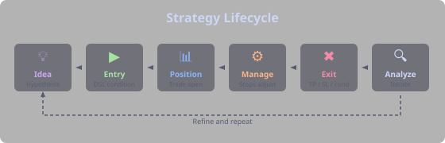
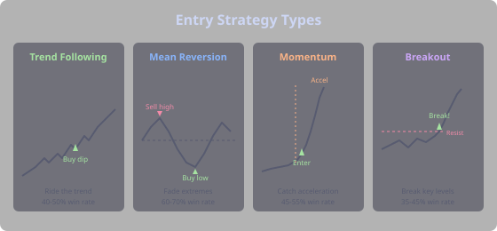
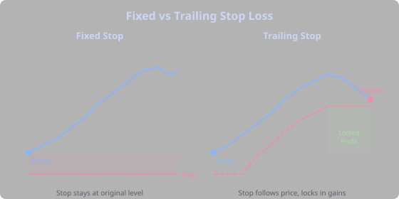
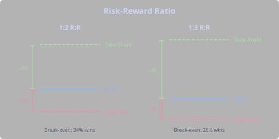
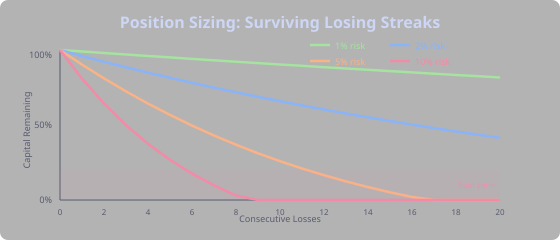

## Your First Strategy



Let's build a real strategy from scratch. Not a theoretical exercise — an actual strategy you can run in Strategy Forge right now. The idea is simple: **buy BTC when it's oversold in an uptrend.**

### The Idea

Every strategy starts with a hypothesis about how markets behave. Ours: when BTC pulls back sharply during an uptrend (RSI drops below 30), it tends to bounce. We're not catching falling knives — we require the long-term trend to be intact (price above the 200-period SMA). Oversold in an uptrend = buying a dip, not fighting a bear market.

Our entry condition:

```
RSI(14) < 30 AND price > SMA(200)
```

### Setting It Up

In Strategy Forge, create a new strategy. Set the entry condition above, then configure your backtest: symbol **BTCUSDT**, timeframe **1h**, duration **6m**, initial capital $10,000, position sizing **10% of equity** per trade. For exits, start with a simple fixed stop loss at -5% and take profit at +10%. One open trade at a time.

### First Backtest

Hit backtest and look at the results. Suppose you see: 15 trades, 53% win rate, profit factor 1.4, max drawdown 12%. Not terrible, not great. The win rate is decent but the profit factor says your winners aren't much larger than your losers. Check the summary — it shows which phases were active during wins vs. losses, and it usually has suggestions.

### Reading the Results

The summary might tell you that trades taken during `uptrend` phase won at 71% vs. 40% in other conditions. It might show that 2pm-6pm UTC trades performed best. The suggestions section might say: "Consider requiring the uptrend phase." This is the data talking — listen to it.

### Iteration 1: Add a Trend Filter

The RSI dip happens in all market conditions, but it only works when there's an actual trend to bounce back into. Add an ADX filter to confirm the trend has strength:

```
RSI(14) < 30 AND price > SMA(200) AND ADX(14) > 20
```

Re-backtest. Now you might see: 10 trades, 60% win rate, profit factor 1.8. Fewer trades, but significantly better quality. The ADX filter removed the trades where RSI was oversold because the market was collapsing, not dipping.

### Iteration 2: Add Phase and Adjust Exits

Add `uptrend` as a required phase in your phase settings — this brings in the daily-timeframe trend confirmation. Switch your exit from fixed take-profit to a trailing stop at 3%, so you can ride the bounce further when momentum is strong. Keep the -5% fixed stop loss as your safety net.

Re-backtest: 8 trades, 75% win rate, profit factor 2.4, max drawdown 7%. Fewer trades, but each one is high quality. The trailing stop lets winners run past the old +10% ceiling when the trend is strong.

### The Lesson

We started with a two-condition entry and ended with a filtered, phase-aware strategy that captures quality setups. The key: **start simple and let the data guide each change.** We didn't add 10 conditions upfront — we added one filter at a time, re-backtested, and checked whether it actually helped. Resist the urge to stack conditions. Every filter you add reduces your trade count, and below 20-30 trades your results stop being statistically meaningful. Simple strategies that make sense are more robust than complex ones that happen to fit historical data.


## Entry Strategies



### Trend Following

Trade in the direction of the established trend. Buy in uptrends, sell in downtrends. This is the most reliable strategy class — and the hardest psychologically, because you're always entering after the move has already started.

**The mindset:** A trend follower doesn't try to catch the bottom. They wait for confirmation that a trend exists and then ride it. They accept missing the first 20% of a move in exchange for catching the middle 60%.

**Example conditions:**
- `ADX(14) > 25 AND PLUS_DI(14) > MINUS_DI(14)` — confirmed uptrend
- `price > SMA(200) AND EMA(20) > EMA(50)` — multiple MA alignment (strong conviction)
- `SUPERTREND(10,3).trend == 1 AND RSI(14) > 40` — supertrend bullish with momentum support

> **Tip:** Trend following has a lower win rate (often 40-50%) but larger winners. A good trend-following strategy might lose 6 out of 10 trades and still be profitable because the 4 winners are each 3-5x larger than the losses. Use trailing stops to capture the full trend — cutting winners early is the biggest mistake trend followers make.

### Mean Reversion

Trade the return to the mean after an overextension. Buy when oversold, sell when overbought. Works best in ranging markets.

**The mindset:** A mean reversion trader is a contrarian at heart. When everyone is panicking and price drops sharply, they buy. When everyone is euphoric and price spikes, they sell. They believe that extreme moves are temporary and price always returns to "fair value."

**Example conditions:**
- `RSI(14) < 30 AND price > SMA(200)` — oversold but still in uptrend (buying a dip, not catching a falling knife)
- `price < BBANDS(20,2).lower AND ADX(14) < 20` — below lower band in a range
- `RANGE_POSITION(20) < -0.8` — near the bottom of the recent range

> **Tip:** Mean reversion has a higher win rate (60-70%) but smaller winners. Use fixed take-profit targets rather than trailing stops. The key danger is that what looks like a mean reversion opportunity might actually be the start of a new trend — which is why the `ADX(14) < 20` filter is so important. If the market is trending, you're not mean-reverting, you're catching a falling knife.

### Momentum

Enter when momentum is accelerating, catching the "meat" of a move. This is like trend following but with more emphasis on timing — you want to enter at the moment the trend kicks into higher gear.

**The mindset:** Momentum traders look for acceleration, not just direction. They want to see not just that price is going up, but that it's going up *faster*. MACD histograms growing, RSI crossing above 50, volume surging — these are their signals.

**Example conditions:**
- `MACD(12,26,9).line crosses_above MACD(12,26,9).signal AND ADX(14) > 20`
- `RSI(14) crosses_above 50 AND price > SMA(50)` — momentum turning bullish

### Breakout

Enter when price breaks through a significant level (support, resistance, or range). Breakout traders wait for the market to show its hand and then jump on the move.

**The mindset:** Breakout traders believe that when price breaks a level it's been respecting, something fundamental has changed. The energy that was being contained within a range now has direction. The key challenge is false breakouts — price breaks a level, triggers entries, and then reverses.

**Example conditions:**
- `close > HIGH_OF(20)` — breakout above 20-period high
- `BBANDS(20,2).width < LOWEST(BBANDS(20,2).width, 50) * 1.1` — volatility squeeze (precedes breakout)
- `RESISTANCE_RAY_CROSSED(1, 200, 5) == 1` — breaking through a resistance trendline

> **Tip:** The best breakouts come after extended periods of compression (low volatility). In Strategy Forge, the Bollinger Band width squeeze is one of the best breakout filters. Combine it with a volume surge (`volume > AVG_VOLUME(20) * 1.5`) to filter out false breakouts.


## Risk Management

Risk management is what separates surviving traders from bankrupt ones. No strategy, no matter how brilliant, is useful without proper risk controls. You will have losing streaks. The question is whether you survive them.

### Stop Losses

A **stop loss** is a predetermined exit point that limits your loss on a trade. Every trade must have one. Period. No exceptions. "I'll just watch it" is not a stop loss strategy.



- **Fixed stop** — set at a specific price level (e.g., below support). Doesn't move. Simple and clear. Mean reversion traders often use these because they have defined invalidation levels.
- **Trailing stop** — moves with price as the trade goes in your favor. Locks in profit while giving the trade room to run. The go-to for trend followers who want to let winners run.
- **ATR-based stop** — set at a multiple of ATR from entry. Adapts to current volatility. A 2x ATR stop on a volatile day is wider than on a calm day — exactly what you want.

> **Tip:** In Strategy Forge exit zones, use `stopLossType: trailing_percent` for trend-following strategies and `stopLossType: fixed_percent` for mean reversion. Many experienced traders use a fixed stop for the initial risk and switch to a trailing stop once the trade moves into profit.

### Take Profit

A **take profit** level is where you close a winning trade. Setting it too tight leaves money on the table; too wide and winners turn into losers.

Approaches:
- **Fixed target** — e.g., +5% from entry. Simple and backtestable. Works well for mean reversion.
- **Risk multiple** — e.g., 2x your stop loss distance. This guarantees your winners are larger than losers.
- **Technical level** — at the next resistance/support level. The most logical but harder to automate.
- **Trailing exit** — let the trade run with a trailing stop. Best for trend following but requires accepting that you'll give back some profit at the end.

### Risk-Reward Ratio

The **risk-reward ratio** (R:R) compares potential loss to potential gain. A 1:2 R:R means you risk $1 to make $2.



With a 1:2 R:R, you only need to win 34% of trades to break even. With 1:3 R:R, just 26%. This is why R:R matters more than win rate — and why experienced traders happily accept strategies with 40% win rates.

**Minimum standards:**
- Never take a trade below 1:1 R:R
- Aim for 1:2 or better for trend following
- 1:1 to 1:1.5 is acceptable for high win-rate mean reversion (70%+)

### Position Sizing

Position sizing determines how much capital to allocate per trade. The goal is to survive losing streaks — because they will come.



- **Fixed percentage** — risk a fixed % of equity per trade (e.g., 1-2%). This is the industry standard. If you have $10,000 and risk 2% per trade, you lose $200 per losing trade. After 10 straight losses (unlikely but possible), you've lost 20% — painful but survivable.
- **Volatility-adjusted** — smaller positions in volatile markets (using ATR). If BTC's ATR doubles, halve your position size. Your dollar risk stays constant.
- **Kelly criterion** — mathematically optimal sizing based on win rate and R:R. In practice, use quarter Kelly — full Kelly is too aggressive and one bad streak wipes you out.

> **Tip:** Professional traders typically risk 0.5-2% per trade. Beginners often risk 5-10%, which feels exciting on winners but is catastrophic during the inevitable losing streak. In Strategy Forge, `positionSizingType: PERCENT_EQUITY` with `positionSizingValue: 10` risks 10% of equity per trade, which is fine for backtesting. For real trading, 1-2% is the standard.


## Backtesting

### Why Backtest?

Backtesting applies your strategy rules to historical data to see how they would have performed. It answers: "Would this idea have made money?" But more importantly, it tells you *how* it would have made money — the win rate, the drawdowns, the longest losing streak.

Benefits:
- Validate ideas before risking real capital
- Understand win rate, drawdown, and risk profile
- Identify which market conditions favor your strategy
- Compare variations objectively — stop arguing with yourself and let the data decide

Every trader has ideas. "What if I bought when RSI is below 30?" is an idea. Without backtesting, you're guessing. With backtesting, you know: it works in ranging markets (62% win rate, 1.8 profit factor) but fails in trending ones (38% win rate, 0.7 profit factor). Now you can add the right phase filter and have a viable strategy.

### Key Metrics

- **Win Rate** — percentage of trades that are profitable. Higher is better, but meaningless without context. A 30% win rate with 1:5 R:R is excellent (those 30% of winners are huge). A 70% win rate with 1:0.5 R:R means you're slowly bleeding.
- **Profit Factor** — gross profit / gross loss. Above 1.5 is good, above 2.0 is excellent. Below 1.0 means you're losing money. This is arguably the single most important metric.
- **Sharpe Ratio** — risk-adjusted return. Above 1.0 is acceptable, above 2.0 is strong. It measures whether your returns justify the volatility you experienced getting them.
- **Max Drawdown** — the largest peak-to-trough decline. Indicates worst-case pain. Keep below 20% for real trading. If your backtest shows 40% max drawdown, your real drawdown will likely be worse.
- **Trade Count** — too few trades means results are not statistically significant. Aim for 30+ trades minimum. A strategy with 8 trades and 100% win rate proves nothing.
- **Capture Ratio** — actual profit vs maximum favorable excursion (MFE). Shows how well you're timing exits. If MFE averages 8% but your average win is 3%, you're leaving a lot on the table — maybe switch to trailing stops.

### Avoiding Curve Fitting

**Curve fitting** (overfitting) is the biggest trap in backtesting. It means your strategy is perfectly tuned to historical data but will fail on new data. It's the equivalent of memorizing test answers instead of understanding the material.

Warning signs:
- Too many conditions (5+ AND clauses). Each condition halves your trade count and doubles the chance you're fitting noise.
- Very specific parameter values (RSI(17) instead of RSI(14)). Why 17? Can you explain it?
- Strategy only works on one symbol or timeframe. If your BTCUSDT 1h strategy doesn't work at all on ETHUSDT 1h, you've probably fit BTC's specific history.
- Adding conditions that improve backtest but have no logical basis. "I added `HOUR > 7 AND HOUR < 19` because it improved results" — can you explain *why* those hours matter?
- Tiny sample size with amazing results. 12 trades, 100% win rate, 50% profit. You've found luck, not an edge.

Prevention:
- Keep rules simple and logical. 2-3 conditions is usually enough.
- Use standard indicator periods (14, 20, 50, 200). These are standard because lots of traders watch them, creating self-fulfilling effects.
- Test on multiple symbols and timeframes. If it works on BTC, ETH, and SOL, the logic is probably sound.
- Use out-of-sample testing (backtest on 6 months, validate on next 6). Strategy Forge's history tracking makes this easy.
- Ask: "Does this make sense from a market structure perspective?" If you can't explain *why* your strategy works, it probably doesn't.

> **Tip:** Strategy Forge's history tracking compares each backtest run to previous ones. If metrics swing wildly with small parameter changes (changing RSI from 14 to 15 flips the strategy from profitable to unprofitable), you're overfitting. A robust strategy shows gradual, not dramatic, sensitivity to parameter changes.
